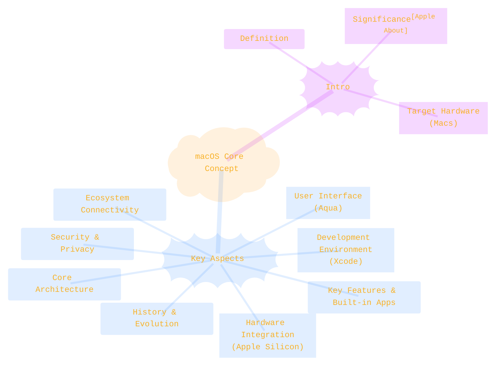
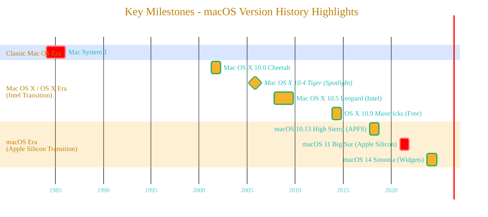
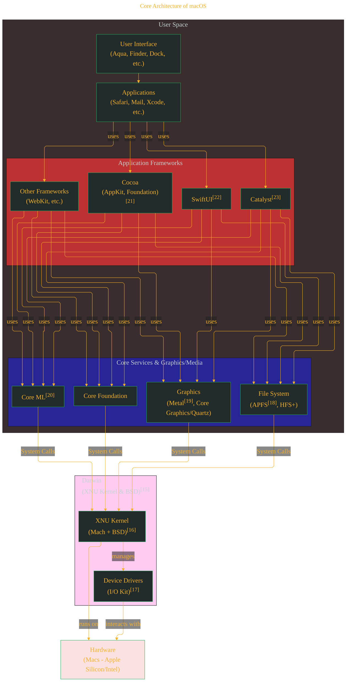
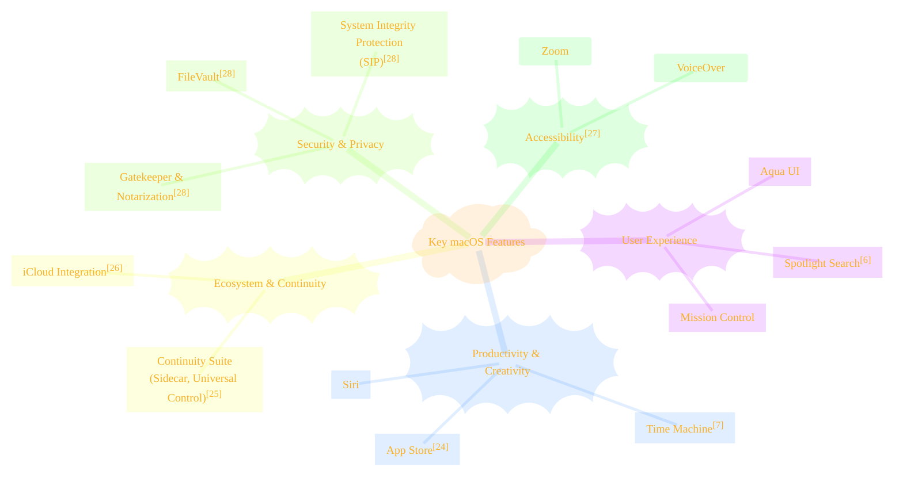
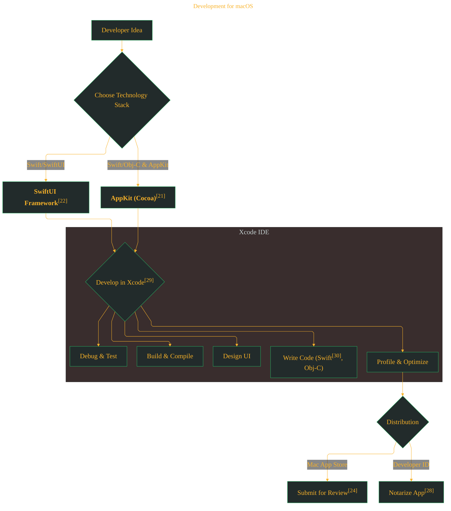
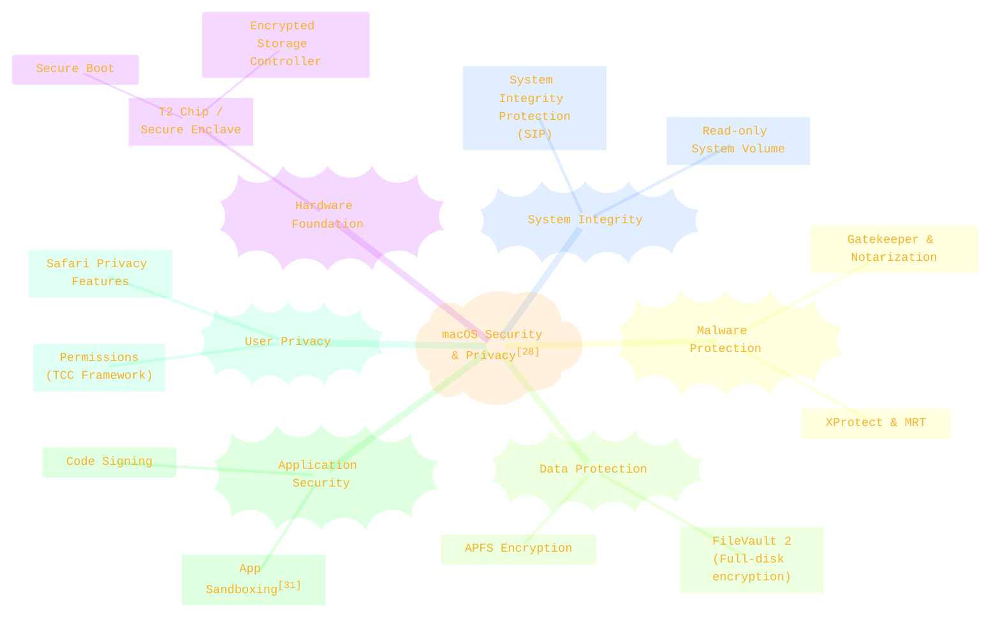
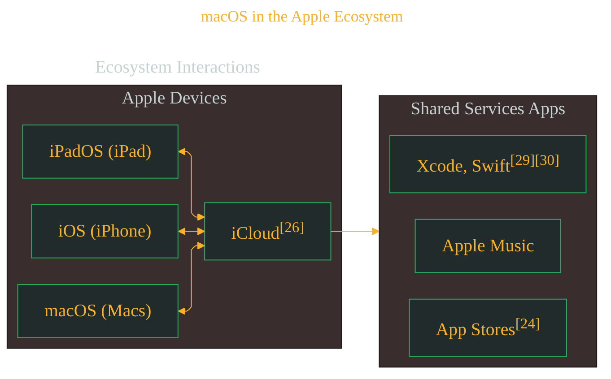
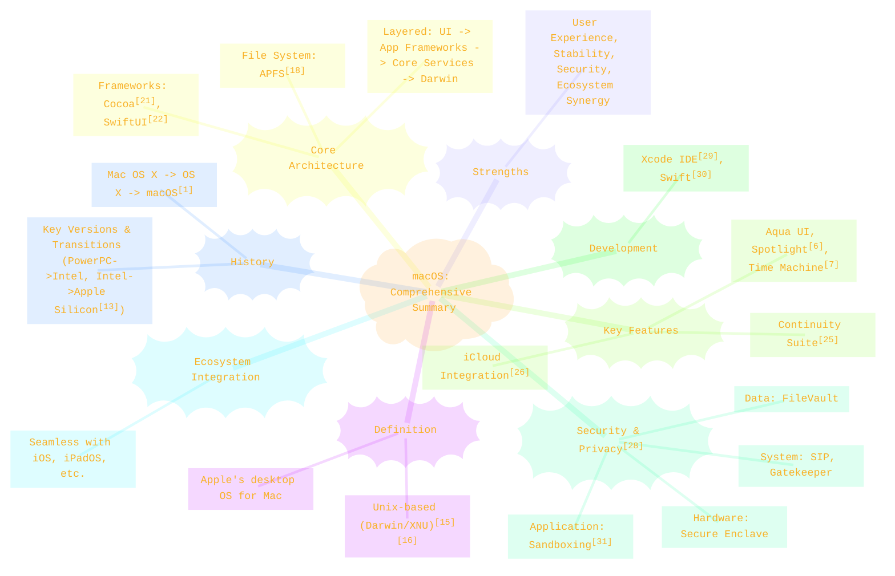

> ⚠️🏗️🚧🦺🧱🪵🪨🪚🛠️👷
> 
> This is a working draft in progress
> 
> 
> 
> gif image is provided by [Giphy](https://giphy.com)
> 
> ⚠️🏗️🚧🦺🧱🪵🪨🪚🛠️👷

----

# Understanding macOS: Apple's Desktop Operating System
> **Disclaimer:**
>
> This document contains my personal notes on the topic,
> compiled from publicly available documentation and various cited sources.
> The materials are intended for educational purposes, personal study, and reference.
> The content is dual-licensed:
> 1. **MIT License:** Applies to all code implementations (Swift, Mermaid, and other programming languages).
> 2. **Creative Commons Attribution-ShareAlike 4.0 International License (CC BY-SA 4.0):** Applies to all non-code content, including text, explanations, diagrams, and illustrations.
---

## 1. Introduction: What is macOS?

macOS is the primary operating system developed and marketed by Apple Inc. for its Mac line of computers, including MacBooks, iMacs, Mac minis, and Mac Pros. Originally named Mac OS X, then OS X, and finally macOS to align with Apple's other operating system nomenclatures (iOS, watchOS, tvOS)[^1], it is renowned for its elegant user interface, robust security features, strong Unix foundation, and seamless integration with Apple's hardware and ecosystem. macOS is the successor to the "classic" Mac OS, which was Apple's primary OS from 1984 until 2001[^2].

This document will delve into the various facets of macOS, exploring its history, core architecture, key features, development environment, security mechanisms, and its pivotal role within the broader Apple ecosystem.

-----

## 2. History and Evolution of macOS

The journey of macOS is a story of innovation, transformation, and resilience. It began with the "classic" Mac OS, which revolutionized personal computing with its graphical user interface (GUI)[^2]. However, by the late 1990s, it faced limitations in performance and modern OS features. This led Apple to acquire NeXT Inc. in 1997, bringing Steve Jobs back to Apple and laying the foundation for Mac OS X with NeXTSTEP's robust, Unix-based core[^3].

**Key Milestones:**

*   **Classic Mac OS (1984-2001):** Pioneered GUIs, but its cooperative multitasking and memory management became outdated.
*   **Mac OS X Public Beta "Kodiak" (2000):** First public look at the new OS, featuring the "Aqua" interface[4].
*   **Mac OS X 10.0 "Cheetah" (March 24, 2001):** The official launch, based on the Darwin (XNU kernel) foundation[5].
*   **Significant Cat-themed Versions (2001-2012):** Versions like Puma, Jaguar, Panther, **Tiger (10.4)** which introduced Spotlight and Dashboard[6], and **Leopard (10.5)** which brought Time Machine, Spaces, and was the first to support Intel processors officially[7]. **Snow Leopard (10.6)** focused on performance, efficiency, and 64-bit support[8].
*   **OS X (2012-2016):** Renaming. Versions themed after California locations.
    *   **Mavericks (10.9, October 22, 2013):** First free major upgrade[9]. Introduced Maps and iBooks.
    *   **Yosemite (10.10, October 16, 2014):** Major redesign with a flatter, more modern UI; introduced Continuity features[10].
*   **macOS (2016-Present):** Renamed to align with other Apple OSes (iOS, watchOS, tvOS) starting with Sierra[1].
    *   **Sierra (10.12):** Introduced Siri to the Mac.
    *   **High Sierra (10.13):** Introduced APFS (Apple File System) as the default for SSDs[11].
    *   **Catalina (10.15):** Dropped 32-bit app support[12]; introduced Sidecar.
    *   **Big Sur (11.0, November 12, 2020):** Major redesign with a more iOS-like feel; first version to support Apple Silicon (M1 chip)[13]. This marked a significant version number jump.
    *   **Monterey (12.0):** Introduced Universal Control, Shortcuts app.
    *   **Ventura (13.0):** Introduced Stage Manager, Continuity Camera.
    *   **Sonoma (14.0, September 26, 2023):** Introduced Desktop Widgets, Game Mode, new screen savers[14].

----

## 3. Core Architecture of macOS

macOS boasts a layered architecture, combining the stability and power of a Unix-like core with high-level frameworks that enable rich application development and a user-friendly interface.

*   **Darwin (Core OS Layer):** The foundation of macOS. It's an open-source, Unix-like operating system[15].
    *   **XNU Kernel:** A hybrid kernel combining Mach microkernel principles (IPC, virtual memory, task scheduling) with BSD components (POSIX API, networking stack, file systems)[16]. This provides preemptive multitasking and protected memory.
    *   **Device Drivers (I/O Kit):** An object-oriented framework for writing device drivers[17].
*   **Core Services & Graphics/Media Layer:**
    *   **File Systems:** Historically HFS+, now predominantly **APFS (Apple File System)**, optimized for SSDs and featuring strong encryption, space sharing, snapshots, and crash protection[11][18].
    *   **Metal:** Apple's low-level, low-overhead API for GPU programming, powering graphics and compute tasks[19].
    *   **Core ML:** For integrating machine learning models into apps[20].
*   **Application Frameworks Layer:**
    *   **Cocoa:** The primary object-oriented application environment for macOS, consisting of AppKit and Foundation[21].
    *   **SwiftUI:** A modern, declarative UI framework for all Apple platforms[22].
    *   **Catalyst (Project Catalyst):** Allows developers to bring their iPad apps built with UIKit to macOS[23].
*   **User Interface Layer (Aqua):** The graphical user interface known for elements like the Dock, Menu Bar, and Finder.

----

## 4. Key Features of macOS

macOS is packed with features designed to enhance productivity, creativity, and user experience.

*   **Spotlight Search:** A system-wide search feature[6].
*   **Time Machine:** An automatic backup utility[7].
*   **App Store:** Apple's digital distribution platform[24].
*   **Continuity & Handoff:** Enables seamless interaction between macOS and iOS/iPadOS devices (e.g., Universal Control, Sidecar[25]).
*   **Siri:** Apple's virtual assistant.
*   **iCloud Integration:** Deep integration with Apple's cloud service[26].
*   **Accessibility:** Comprehensive built-in features like VoiceOver and Zoom[27].
*   **Gatekeeper & Notarization:** Security features to protect from malware[28].
*   **FileVault:** Full-disk encryption[28, Section: Data-at-Rest Protection].
*   **System Integrity Protection (SIP):** Restricts root user actions on protected parts of macOS[28, Section: System Integrity Protection].

---

## 5. Development for macOS

Developing applications for macOS is primarily done using Apple's integrated development environment (IDE), Xcode.

*   **Xcode:** The comprehensive IDE for all Apple platforms[29].
*   **Programming Languages:**
    *   **Swift:** Apple's modern, preferred language[30].
    *   **Objective-C:** Historical language, interoperable with Swift[21].
*   **Frameworks:** AppKit, SwiftUI[22], Metal[19], Core ML[20].
*   **Distribution:** Mac App Store[24], or Developer ID for direct distribution[28, Section: Gatekeeper and Notarization].

----

## 6. Security and Privacy in macOS

Apple places a strong emphasis on security and privacy in macOS.

*   **Hardware-based Security:**
    *   **Apple T2 Security Chip / Secure Enclave (on Apple Silicon):** Provides secure boot, encrypted storage, and Touch ID/Face ID data protection[28, Section: Hardware Security].
*   **System-Level Security:**
    *   **Secure Boot:** Ensures trusted OS software[28, Section: Boot Process Security].
    *   **System Integrity Protection (SIP):** Protects system files from modification[28, Section: System Integrity Protection].
    *   **Gatekeeper & Notarization:** Validates software before it runs[28, Section: Gatekeeper and Notarization].
    *   **XProtect & MRT:** Built-in anti-malware tools[28, Section: Malware Prevention].
*   **Data Protection:**
    *   **FileVault 2:** Full-disk encryption[28, Section: Data-at-Rest Protection].
*   **Application Security:**
    *   **App Sandboxing:** Restricts app access to system resources[31].
    *   **Code Signing:** Verifies developer identity and code integrity[28].
*   **Privacy Controls:**
    *   **Permissions Prompts (TCC):** User consent for access to sensitive data (location, camera, etc.)[28, Section: Access to User Data].

----

## 7. macOS in the Apple Ecosystem

macOS is a cornerstone of Apple's tightly integrated ecosystem.

*   **Hardware-Software Integration:** Deep optimization between macOS and Mac hardware (especially Apple Silicon[13]).
*   **iCloud:** Cloud storage and synchronization for photos, files, mail, contacts, etc.[26].
*   **Continuity Features:** Handoff, Universal Clipboard, Sidecar, Universal Control[25].
*   **Communication:** Messages and FaceTime.
*   **Media & Content:** Apple Music, Apple TV+, etc.
*   **Find My:** Locate lost devices.

----

## 8. Conclusion: The Enduring Appeal of macOS

macOS stands as a testament to Apple's commitment to creating a powerful, secure, and user-friendly computing experience. Its Unix foundation provides stability[15], while its Aqua interface and rich application frameworks empower users and developers. The integration with Apple hardware, particularly Apple Silicon[13], has further enhanced its capabilities.

The continuous evolution of macOS, with regular updates introducing innovative features and strengthened security[28], ensures its relevance. Its seamless connectivity within the Apple ecosystem makes it a compelling choice for users of Apple's devices and services.

---

<!-- 

---
>**Licenses:**
>
>- **MIT License:**   - Full text in [LICENSE](LICENSE) file.
>- **Creative Commons Attribution-ShareAlike 4.0 International**: [CC BY-SA 4.0](https://creativecommons.org/licenses/by-sa/4.0/)  - Legal details in [LICENSE-CC-BY-SA-4.0](THE_PAST/LICENSE-CC-BY-SA-4.0) and at [Creative Commons official site](https://creativecommons.org/licenses/by-sa/4.0/).
>
---

## References
[^1]: Gurman, M. (2016, June 13). *OS X is dead, long live macOS*. Bloomberg. (Historically, numerous tech news sites covered this rebranding at WWDC 2016. Apple also updated its websites.) 
[^2]: Apple Inc. (n.d.). *Apple History*. Retrieved from [Apple Newsroom History](https://www.apple.com/newsroom/history/)
[^3]: Isaacson, W. (2011). *Steve Jobs*. Simon & Schuster. (Details the NeXT acquisition and its technology's role in OS X).

<small>Example contemporary report: [TechCrunch article on macOS Sierra naming](https://techcrunch.com/2016/06/13/apple-rebrands-os-x-macos-announces-macos-sierra/)</small> 
<small>[4] Siracusa, J. (2000, September 13). *Mac OS X Public Beta Review*. Ars Technica. Retrieved from [Ars Technica Archives](https://arstechnica.com/gadgets/2000/09/mac-os-x-public-beta/)</small> 
<small>[5] Apple Inc. (2001, March 21). *Mac OS X Hits Stores This Weekend*. [Apple Newsroom PR](https://www.apple.com/newsroom/2001/03/21Mac-OS-X-Hits-Stores-This-Weekend/)</small> 
<small>[6] Apple Inc. (2005, April 12). *Apple to Ship Mac OS X "Tiger" on April 29*. [Apple Newsroom PR](https://www.apple.com/newsroom/2005/04/12Apple-to-Ship-Mac-OS-X-Tiger-on-April-29/)</small> 
<small>[7] Apple Inc. (2007, October 16). *Mac OS X Leopard To Ship October 26*. [Apple Newsroom PR](https://www.apple.com/newsroom/2007/10/16Mac-OS-X-Leopard-To-Ship-October-26/)</small> 
<small>[8] Apple Inc. (2009, August 24). *Mac OS X Snow Leopard Available August 28*. [Apple Developer News Archive (or similar official source if Newsroom link is elusive for older releases)]</small> 
<small>[9] Apple Inc. (2013, October 22). *OS X Mavericks Available Today Free from the Mac App Store*. [Apple Newsroom PR](https://www.apple.com/newsroom/2013/10/22OS-X-Mavericks-Available-Today-Free-from-the-Mac-App-Store/)</small> 
<small>[10] Apple Inc. (2014, October 16). *OS X Yosemite Available Today as a Free Upgrade*. [Apple Newsroom PR](https://www.apple.com/newsroom/2014/10/16OS-X-Yosemite-Available-Today-as-a-Free-Upgrade/)</small> 
<small>[11] Apple Inc. (2017, June 5). *macOS High Sierra advances platform technologies, introduces new experiences*. [Apple Newsroom PR (initial announcement, APFS details often in developer docs too)](https://www.apple.com/newsroom/2017/06/macos-high-sierra-advances-platform-technologies/)</small> 
<small>[12] Apple Inc. (2019). *32-bit app compatibility with macOS High Sierra 10.13.4 and later*. [Apple Support HT208436](https://support.apple.com/en-us/HT208436). (Catalina was the version that fully removed support).</small> 
<small>[13] Apple Inc. (2020, November 10). *Introducing the next generation of Mac*. [Apple Newsroom PR](https://www.apple.com/newsroom/2020/11/introducing-the-next-generation-of-mac/)</small> 
<small>[14] Apple Inc. (2023, September 26). *macOS Sonoma is available today*. [Apple Newsroom PR](https://www.apple.com/newsroom/2023/09/macos-sonoma-is-available-today/)</small> 
<small>[15] Apple Inc. (n.d.). *Darwin Open Source*. Retrieved from [opensource.apple.com/source/Darwin/](https://opensource.apple.com/)</small> 
<small>[16] Singh, A. (2006). *Mac OS X Internals: A Systems Approach*. Addison-Wesley Professional. (A detailed technical book, can also reference Apple Kernel Programming Guide if available).</small> 
<small>[17] Apple Inc. (n.d.). *I/O Kit Fundamentals*. [Apple Developer Documentation](https://developer.apple.com/library/archive/documentation/DeviceDrivers/Conceptual/IOKitFundamentals/ทำความเข้าใจIOKit/ทำความเข้าใจIOKit.html) (Archived, but principles hold).</small> 
<small>[18] Apple Inc. (n.d.). *About Apple File System*. [Apple Developer Documentation](https://developer.apple.com/library/archive/documentation/FileManagement/Conceptual/APFS_Guide/Introduction/Introduction.html).</small> 
<small>[19] Apple Inc. (n.d.). *Metal*. [Apple Developer Documentation](https://developer.apple.com/metal/).</small> 
<small>[20] Apple Inc. (n.d.). *Core ML*. [Apple Developer Documentation](https://developer.apple.com/documentation/coreml).</small> 
<small>[21] Apple Inc. (n.d.). *Cocoa Application Competencies for macOS*. [Apple Developer Documentation](https://developer.apple.com/library/archive/documentation/MacOSX/Conceptual/OSXTechnologies/CocoaTechnologies/CocoaTechnologies.html).</small> 
<small>[22] Apple Inc. (n.d.). *SwiftUI*. [Apple Developer Documentation](https://developer.apple.com/xcode/swiftui/).</small> 
<small>[23] Apple Inc. (n.d.). *Mac Catalyst*. [Apple Developer Documentation](https://developer.apple.com/mac-catalyst/).</small> 
<small>[24] Apple Inc. (n.d.). *Mac App Store*. Retrieved from [apple.com/mac/app-store/](https://www.apple.com/mac/app-store/).</small> 
<small>[25] Apple Inc. (n.d.). *Continuity: Use your Mac, iPhone, iPad, and Apple Watch together*. [Apple Support HT204681](https://support.apple.com/en-us/HT204681).</small> 
<small>[26] Apple Inc. (n.d.). *iCloud*. Retrieved from [apple.com/icloud/](https://www.apple.com/icloud/).</small> 
<small>[27] Apple Inc. (n.d.). *Accessibility - Mac*. Retrieved from [apple.com/accessibility/mac/](https://www.apple.com/accessibility/mac/).</small> 
<small>[28] Apple Inc. (2023, May). *Apple Platform Security*. [Apple Support - Platform Security Guide](https://support.apple.com/guide/security/welcome/web) or direct PDF link. This is a comprehensive source for many security features.</small> 
<small>[29] Apple Inc. (n.d.). *Xcode*. [Apple Developer Documentation](https://developer.apple.com/xcode/).</small> 
<small>[30] Apple Inc. (n.d.). *Swift*. [Apple Developer Documentation](https://developer.apple.com/swift/).</small> 
<small>[31] Apple Inc. (n.d.). *App Sandbox*. [Apple Developer Documentation](https://developer.apple.com/library/archive/documentation/Security/Conceptual/AppSandboxDesignGuide/AboutAppSandbox/AboutAppSandbox.html).</small> 
<small>[Apple About] Apple Inc. (n.d.). *About Apple*. Retrieved from [apple.com/about/](https://www.apple.com/about/). (General company information).</small>

---
