> ⚠️🏗️🚧🦺🧱🪵🪨🪚🛠️👷
> 
> This is a working draft in progress
> 
> 
> 
> gif image is provided by [Giphy](https://giphy.com)
> 
> ⚠️🏗️🚧🦺🧱🪵🪨🪚🛠️👷

----

# History of Unix
<details open>
<summary>Click to show/hide the full disclaimer.</summary>
   
> <ins>📢 **Disclaimer** 🚨</ins>
>
> This document contains my personal notes on the topic,
> compiled from publicly available documentation and various cited sources.
> The materials are intended for educational purposes (<ins>sometimes, entertainment purposes</ins>), personal study, and reference.
> The content is dual-licensed:
> 1. **MIT License:** Applies to all code implementations (Swift, Mermaid, and other programming languages).
> 2. **Creative Commons Attribution-ShareAlike 4.0 International License (CC BY-SA 4.0):** Applies to all non-code content, including text, explanations, diagrams, and illustrations.

</details>

---


## The Dawn of Time-Sharing: From Multics to a New Vision 🌌

The story of Unix begins in the ambitious, yet ultimately cumbersome, Multics project.

### The Multics Context (Mid-1960s)

Multics (Multiplexed Information and Computer Services) was a pioneering time-sharing operating system project.

```mermaid
---
title: "The Multics Context (Mid-1960s)"
author: "Cong Le"
version: "1.0"
license(s): "MIT, CC BY-SA 4.0"
copyright: "Copyright (c) 2025 Cong Le. All Rights Reserved."
config:
  layout: elk
  theme: base
---
%%%%%%%% Mermaid version v11.4.1-b.14
%%%%%%%% Available curve styles include the following keywords:
%% basis, bumpX, bumpY, cardinal, catmullRom, linear, monotoneX, monotoneY, natural, step, stepAfter, stepBefore.
%%{
  init: {
    'flowchart': { 'htmlLabels': true, 'curve': 'linear'},
    'fontFamily': 'Monaco',
    'themeVariables': {
      'primaryColor': '#2BB3',
      'primaryTextColor': '#F8B229',
      'lineColor': '#F8B229',
      'primaryBorderColor': '#27AE60',
      'secondaryColor': '#EEF2',
      'secondaryTextColor': '#6C3483',
      'secondaryBorderColor': '#A569BD',
      'fontSize': '15px'
    }
  }
}%%
flowchart TD
    subgraph Multics_Project["Multics Project<br/>(Mid-1960s)"]
    style Multics_Project fill:#f922,stroke:#333,stroke-width:2px
        ORG_MIT["🏢 MIT"]
        ORG_BellLabs["🔔 Bell Labs"]
        ORG_GE["💡 General Electric"]
        Mainframe["💻 GE-645 Mainframe"]

        ORG_MIT -->|Collaboration| Mainframe
        ORG_BellLabs -->|Collaboration| Mainframe
        ORG_GE -->|Collaboration| Mainframe
        Mainframe --> Multics_OS[("💡 Multics OS")]

        Multics_OS --> Feat1["Novel Idea:<br/>Single-Level Store"]
        Multics_OS --> Feat2["Goal:<br/>Time-Sharing"]
        Multics_OS --> Problem1["😟 Problems:<br/>Size & Complexity"]
    end

    BellLabs_Frustration["🔔 Bell Labs:<br/>Frustrated by Complexity"]
    Problem1 --> BellLabs_Frustration
    BellLabs_Frustration --> BellLabs_Withdrawal["🚫 Bell Labs Withdraws"]

    BellLabs_Withdrawal --> Researchers_Vision["👨‍💻 Researchers<br/>(Thompson, Ritchie, McIlroy, Ossanna)"]
    Researchers_Vision --> New_System_Idea["💡 Idea:<br/>Redo, but Simpler!"]

    click ORG_MIT "https://en.wikipedia.org/wiki/Massachusetts_Institute_of_Technology" "MIT"
    click ORG_BellLabs "https://en.wikipedia.org/wiki/Bell_Labs" "Bell Labs"
    click ORG_GE "https://en.wikipedia.org/wiki/General_Electric" "General Electric"
    click Mainframe "https://en.wikipedia.org/wiki/GE-600_series" "GE-645 Mainframe"
    click Multics_OS "https://en.wikipedia.org/wiki/Multics" "Multics OS"
    
```



**Key takeaway from Multics:**
*   **Single-Level Store:** Programs address data as if it's always in memory. The OS handles loading from disk invisibly.

  $$
  \text{Virtual Address Space} \leftrightarrow \text{Physical Memory} + \text{Disk Storage}
  $$

*Ken Thompson later viewed this as problematic due to differing access patterns for code (read-only, random access) vs. data (writable, sequential/random access).*

---

### Vision for a New System (Late 1960s) 💡

Frustrated but inspired researchers from Bell Labs, including Ken Thompson and Dennis Ritchie, envisioned a simpler system focused on a good programming environment and fostering a "fellowship."

**Thompson's Idea for the New System:**
*   Keep: Hierarchical File System (from Multics)
*   Remove: Single-Level Store (programmers would manage I/O explicitly)

**The Serendipitous PDP-7 and *Space Travel* 🚀:**
Ken Thompson's game, *Space Travel*, initially written on a GE-635, became a catalyst. The high cost of running it ($75 per game, ouch! 💸) and the availability of an underused PDP-7 led to a pivotal moment.

```mermaid
---
title: "Vision for a New System (Late 1960s)"
author: "Cong Le"
version: "1.0"
license(s): "MIT, CC BY-SA 4.0"
copyright: "Copyright (c) 2025 Cong Le. All Rights Reserved."
config:
  layout: elk
  theme: base
---
%%%%%%%% Mermaid version v11.4.1-b.14
%%%%%%%% Available curve styles include the following keywords:
%% basis, bumpX, bumpY, cardinal, catmullRom, linear, monotoneX, monotoneY, natural, step, stepAfter, stepBefore.
%%{
  init: {
    'flowchart': { 'htmlLabels': true, 'curve': 'linear'},
    'fontFamily': 'Monaco',
    'themeVariables': {
      'primaryColor': '#2BB3',
      'primaryTextColor': '#F8B229',
      'lineColor': '#F8B229',
      'primaryBorderColor': '#27AE60',
      'secondaryColor': '#EEF2',
      'secondaryTextColor': '#6C3483',
      'secondaryBorderColor': '#A569BD',
      'fontSize': '15px'
    }
  }
}%%
flowchart LR
    subgraph Path_to_PDP_7_Unix["Path to PDP-7 Unix"]
        Thompson["👨‍💻 Ken Thompson"] --> SpaceTravel_GECOS["🎮 Space Travel <br/>(on GECOS for GE-635)"]
        SpaceTravel_GECOS --> Cost{"High CPU Cost?<br/>($75/game)"}
        Cost -- Yes --> LookForAlternative["🖥️ Alternative Machine"]
        LookForAlternative --> PDP7_Found["🖥️ Discovers unused PDP-7"]
        PDP7_Found --> RewriteSpaceTravel_PDP7["✨ Rewrites Space Travel for PDP-7"]
        RewriteSpaceTravel_PDP7 --> TediousProcess["😩 Tedious:<br/> Cross-compile & Paper Tape"]
        TediousProcess --> Idea_NewOS_PDP7["💡 Idea:<br/>Build New OS on PDP-7!"]

        Idea_NewOS_PDP7 --> Collaboration["🤝 With Ritchie & Canaday"]
        Collaboration --> Impl_FileSystem["🌳 Hierarchical File System"]
        Impl_FileSystem --> Impl_ProcessLoading["🔄 Program Loading & Execution"]
        Impl_ProcessLoading --> Impl_ShellUtils["🛠️ Shell & Basic Utilities<br/>(cp, rm, ed)"]
        Impl_ShellUtils --> Impl_NewAssembler["✍️ New Assembler for PDP-7"]
        Impl_NewAssembler --> SpaceTravel_On_NewOS["🎮 Space Travel runs on new OS!"]
    end
```



**Key Innovations during PDP-7 Development:**
1.  **Hierarchical File System:** Borrowed concept, implemented anew.
2.  **Device Files (Ritchie's Idea 💡):** Special files in the filesystem representing hardware devices. This abstracted I/O, allowing programs to treat devices like regular files.
    *   Example: `/dev/tty` for the terminal.
3.  **First High-Level Language:** Douglas McIlroy ported TMG (compiler-compiler), which Thompson then used to create the **B programming language**.

----

## The 1970s: Naming, Growth, C, and Licensing 📈

This decade saw the fledgling OS get a name, migrate to more powerful hardware, be rewritten in C, and begin its spread outside Bell Labs.

### Unics to Unix ✨

*   **Initial State:** Single-tasking OS.
*   **1970: Name "Unics" proposed by Brian Kernighan:** (Uniplexed Information and Computing Service) - a pun on "Multics" (Multiplexed Information and Computer Services).
*   **Final Spelling:** "Unix" (originator of spelling is unclear, but Kernighan, Ritchie, and McIlroy are often credited with the popularization).

### Move to PDP-11 and Early Applications 📄

The need for word processing by Bell Labs' Patent Department led to funding for a PDP-11/45.

```mermaid
gantt
    title Unix Evolution in the Early 1970s
    dateFormat  YYYY
    axisFormat %Y

    section PDP-7 Era
    Initial Development :crit, dev1, 1969, 1y
    B Language Developed : dev2, after dev1, 6mo

    section PDP-11 Era & Early Growth
    Funding for PDP-11/45 :milestone, funding, 1970, 0d
    Unix Named & on PDP-11 :event, named_pdp11, 1970, 0d
    Text Processing (roff, editor) :textproc, after named_pdp11, 1y
    UNIX Programmer's Manual (Nov 1971) :manual, 1971, 0d, type:milestone
    Version 4 Unix (Widely used in Bell Labs) :v4, 1973, 0d, type:milestone
    Rewritten in C (Version 4) :c_rewrite, 1973, 0d, type:event
    Formal Presentation (SOSP '73) :sosp, 1973, 0d, type:milestone
    Licensing to Educational Institutions (V5) :lic_edu, 1973, 0d
    Licensing to Companies (V6) :lic_com, 1975, 0d
    Pipes Concept Introduced (V5/V6) :pipes, 1975, 0d % Approximate timing for conceptual impact
    First Port (Interdata 8/32) :port_interdata, 1977-1978, 1y
    Version 7 Unix Released :v7, 1979, 0d, type:milestone
```

### The Revolutionary Rewrite in C Language 🔄️

In 1973, Version 4 Unix was largely rewritten in C. This was a groundbreaking move, as OSes were typically written in assembly language for performance.
*   **Impact of C:**
    *   **Portability:** Made it much easier to move Unix to different computer architectures.
    *   **Maintainability:** Easier to read, write, and debug code.
    *   The C language itself evolved alongside Unix.

*"The migration to C suggested portability of the software, requiring only a relatively small amount of machine-dependent code to be replaced when porting Unix to other computing platforms."*

### Licensing and Spread 🌍

Due to a 1956 consent decree, AT&T (Bell Labs' parent) couldn't turn Unix into a commercial product initially. They licensed it for the cost of media and shipping.
*   **"Love, Ken"**: Legend says Ken Thompson shipped early tapes with this note. ❤️
*   **Version 5 (1973):** Licensed to educational institutions.
*   **Version 6 (1975):** Licensed to companies (US$20,000 - quite a sum then!). Became widely used.
    *   Included source code, on an "as-is" basis.
    *   *Lions' Commentary on UNIX 6th Edition, with Source Code* became an influential educational tool.
*   **USENIX (1974):** First Unix users group meeting, crucial for community support as AT&T didn't officially support Unix.

### Key Technical Advancement: Pipes 💧➡️💧

Introduced around Version 5/6, pipes allowed the output of one program to be directly fed as input to another, fostering a philosophy of small, single-purpose tools.
Represented by the `|` symbol in the shell:
`command1 | command2`

### System Call Growth 📞

A measure of an OS's complexity and feature set.
*   **Version 7 Unix (1979):** $\approx 50$ system calls.
*   **4.4BSD:** $\approx 110$ system calls.
*   **SVR4:** $\approx 120$ system calls.
*   **Linux 3.2.0:** $380$ system calls.
*   **FreeBSD 8.0:** $> 450$ system calls.

This shows a significant expansion in kernel capabilities over time.

----


## The 1980s: Commercialization, Proliferation, and the Unix Wars ⚔️

This decade saw Unix explode in popularity, fragment into different versions, and become a commercial product, leading to intense competition.

```dot
/*
 * title: The 1980s: Commercialization, Proliferation, and the Unix Wars
 * author: Cong Le
 * version: 1.0
 * license(s): MIT, CC BY-SA 4.0
 * copyright: Copyright (c) 2025 Cong Le. All Rights Reserved.
 */
digraph Unix_1980s_Landscape {
    rankdir="TB";
    node [shape=box, style=rounded];
    bgcolor="transparent";

    subgraph "AT&T / Bell Labs" {
        label="AT&T / Bell Labs";
        style=filled;
        color=lightblue;
        V7 [label="Research Unix V7 (1979)"];
        SysIII [label="UNIX System III (1981)\n(V7 + PWB)"];
        SysV_R1 [label="UNIX System V R1 (1983)\n(Merged internal versions, vi, curses from BSD)"];
        Research_V8_V9_V10 [label="Research Unix\nV8 (1985), V9 (1986), V10 (1989)\n(Internal/Universities)"];
        Plan9_Start [label="Plan 9 (Late 80s)\n(Research Successor)"];

        V7 -> SysIII;
        SysIII -> SysV_R1;
        V7 -> Research_V8_V9_V10 -> Plan9_Start;
    }

    subgraph "Berkeley (UCB)" {
        label="Berkeley (UCB) - BSD";
        style=filled;
        color=lightgreen;
        BSD_Base [label="Based on V6/V7"];
        BSD_4_1c [label="4.1cBSD\n(C Shell, Job Control)"];
        BSD_4_2 [label="4.2BSD\n(TCP/IP Networking!)"];
        BSD_4_3 [label="4.3BSD / Tahoe / Reno"];
        Net1_Net2 [label="Net/1, Net/2\n(Networking Code)"];

        BSD_Base -> BSD_4_1c -> BSD_4_2 -> BSD_4_3 -> Net1_Net2;
        SysV_R1 -> BSD_4_2 [style=dotted, label="vi, curses"]; // Features adopted by SysV
        BSD_4_2 -> SysV_R1 [style=dotted, label="TCP/IP influence later"];
    }

    subgraph "Commercial Unix & Derivatives" {
        label="Commercial Unix & Derivatives";
        style=filled;
        color=lightgrey;
        Xenix [label="Microsoft Xenix (1980)\n(Based on V7/SysIII, for Micros)"];
        SCO_Xenix [label="SCO Xenix\n(Ported Xenix to 8086)"];
        SunOS [label="Sun Microsystems SunOS (1982)\n(BSD-based, for Workstations)"];
        Onyx_C8002 [label="Onyx Systems C8002 (1980)\n(Z8000-based micro)"];
        Other_SysV_Derivs [label="Other System V Derivatives"];
        Other_BSD_Derivs [label="Other BSD Derivatives"];

        SysIII -> Xenix;
        Xenix -> SCO_Xenix;
        BSD_4_2 -> SunOS;
        V7 -> Onyx_C8002;
        SysV_R1 -> Other_SysV_Derivs;
        BSD_4_3 -> Other_BSD_Derivs;
    }

    subgraph "Standardization & Conflict (Mid-Late 80s)" {
        label="Standardization & Conflict";
        style=filled;
        color=lightcoral;
        node [style="filled,rounded", fillcolor=white];

        ATTD breakup [label="AT&T Breakup (1983)\n(Allowed commercialization)"];
        SVID [label="SVID (System V Interface Definition, 1985)\n(AT&T Standard)"];
        XOpen [label="X/Open (1984)\n(European Vendors' Standard based on Unix/SVID)"];
        POSIX [label="IEEE POSIX (1988)\n(API for SysV & BSD)"];
        Unix_Wars [label="🔥 Unix Wars 🔥"];

        UI [label="Unix International (UI)\n(AT&T + Sun)\nGoal: Merge SysV, BSD, Xenix -> SysV R4"];
        OSF [label="Open Software Foundation (OSF)\n(Other Vendors: DEC, HP, IBM)\nGoal: OSF/1"];

        SysV_R1 -> SVID;
        SVID -> XOpen [style=dotted, label="influence"];
        SysV_R1 -> POSIX [style=dotted, label="basis for"];
        BSD_4_3 -> POSIX [style=dotted, label="basis for"];

        ATTD_breakup -> SysV_R1 [label="enabled broader market entry"];
        ATTD_breakup -> Unix_Wars [label="intensified"];
        SysV_R1 -> UI;
        SunOS -> UI;
        UI -> Unix_Wars [dir=both];
        OSF -> Unix_Wars [dir=both];
    }

    ATTD_breakup;

    GNU_Project [label="GNU Project Founded (1983)\n(Richard Stallman)", shape=ellipse, style=filled, fillcolor=orange];
    ATTD_breakup -> GNU_Project [style=invis]; // Conceptually related by year, new directions

    edge [fontsize=10];
}
```



**Key Developments in the 1980s:**
*   **AT&T Breakup (1983):** Freed AT&T to commercialize Unix. Resulted in **UNIX System V**.
*   **BSD Development:** UC Berkeley continued to enhance BSD, notably adding **TCP/IP networking** (ancestor of much modern internet code) and the **Berkeley Sockets API**.
*   **Proliferation of Vendors:** Many companies (Sun, Microsoft with Xenix, SCO, HP, IBM, DEC) created their own Unix versions, based on either System V or BSD, or a mix.
*   **Unix Wars:** Intense competition and fragmentation.
    *   **Unix International (UI):** AT&T & Sun-led group aiming to unify System V, BSD, and Xenix into **System V Release 4 (SVR4)**.
    *   **Open Software Foundation (OSF):** Formed by rival vendors (DEC, HP, IBM) to create their own standard, **OSF/1**.
*   **Standardization Efforts:**
    *   **SVID (System V Interface Definition):** AT&T's standard.
    *   **X/Open:** Consortium for an open system spec.
    *   **POSIX (Portable Operating System Interface for Computer Environments):** IEEE standard aiming to unify APIs for BSD and System V. Became very influential.
*   **GNU Project (1983):** Richard Stallman founded the GNU Project to create a free Unix-like operating system. This would later become crucial with Linux.

> *"Observers began to see Unix as a potential universal operating system, suitable for all computers."*

But the "Unix Wars" and lack of binary compatibility were significant hurdles.

----

## The 1990s: Resolution, Linux Rising, and a new Mac OS 🕊️🐧🍏

The Unix Wars subsided, new free alternatives emerged, and Apple chose a Unix-based future.

### End of the Major Unix Wars ☮️

*   **COSE (Common Open Software Environment) (1993):** Major Unix players collaborated, signaling an end to the most intense phase of the wars.
*   **UI and OSF Merger (1994):** Formed a new entity retaining the OSF name, effectively ending the OSF/1 vs SVR4 battle. Work on OSF/1 was largely stopped (DEC's Digital UNIX/Tru64 UNIX was an exception).
*   **POSIX** solidified its role as the unifying standard.

### The BSD World: Legal Troubles and Free Offshoots lawsuits: 🏛️

*   **BSDi (Berkeley Software Design, Inc.) (1991):** Founded by ex-Berkeley developers to sell a commercial BSD, claiming it was free of AT&T code.
*   **Lawsuit:** AT&T's Unix subsidiary (USL) sued BSDi. UC Berkeley countersued.
*   **386BSD (Bill Jolitz):** A free software fork that became the ancestor of **FreeBSD, OpenBSD, and NetBSD**.
*   **Novell Acquires USL (and Unix rights from AT&T):** Dennis Ritchie famously likened this to Esau selling his birthright. Novell settled the lawsuits with BSDi and Berkeley.
*   **Novell Transfers UNIX Trademark to X/Open (1993):** X/Open merged with OSF in 1996 to form **The Open Group**, which now owns the UNIX trademark and manages the Single UNIX Specification.

```mermaid
---
title: "The BSD World: Legal Troubles and Free Offshoots lawsuits"
author: "Cong Le"
version: "0.1"
license(s): "MIT, CC BY 4.0"
copyright: "Copyright (c) 2025 Cong Le. All Rights Reserved."
config:
  layout: elk
  theme: base
---
%%%%%%%% Mermaid version v11.4.1-b.14
%%{
  init: {
    'sequence': { 'mirrorActors': true, 'showSequenceNumbers': true, 'actorMargin': 50 },
    'fontFamily': 'Monaco',
    'themeVariables': {
      'primaryColor': '#2BB8',
      'primaryBorderColor': '#7C0000',
      'lineColor': '#F8B229',
      'secondaryColor': '#6122',
      'tertiaryColor': '#fff',
      'fontSize': '15px',
      'textColor': '#F8B229',
      'actorTextColor': '#E2E',
      'stroke':'#033',
      'stroke-width': '0.2px'
    }
  }
}%%
sequenceDiagram
    participant UCB as University of California, Berkeley
    participant BSD_Devs as BSD Developers<br/>(Jolitz, Karels, etc.)
    participant BSDi as Berkeley Software Design, Inc.
    participant ATTSL as AT&T System Labs <br/>(USL)
    participant Novell
    participant XOpen as X/Open Consortium
    participant OpenGroup as The Open Group

    UCB ->> BSD_Devs: Develops BSD code
    BSD_Devs ->> BSDi: Form BSDi (1991), sell commercial BSD
    Note over BSDi: Claims AT&T code-free
    ATTSL ->> BSDi: ⚖️ Sues for copyright infringement
    UCB ->> ATTSL: ⚖️ Countersues
    
    %% critical Bill Jolitz forks 386BSD
    %%    BSD_Devs --> Jolitz_386BSD((386BSD))
    %%    Jolitz_386BSD --> FreeBSD((FreeBSD))
    %%    Jolitz_386BSD --> NetBSD((NetBSD))
    %%    Jolitz_386BSD --> OpenBSD((OpenBSD))
    %% end

    ATTSL ->> Novell: Novell acquires USL <br/>(Unix rights) <br/>(1991-93)
    Novell ->> BSDi: Settles lawsuit
    Novell ->> UCB: Settles lawsuit

    Novell ->> XOpen: Transfers UNIX Trademark <br/>(1993)
    XOpen -->> OpenGroup: Merges with OSF to form The Open Group<br/>(1996)
    OpenGroup -->> OpenGroup: Manages Single UNIX Specification
```



### Apple Chooses a Unix Path 🍏

*   **1997:** Apple acquires NeXT.
*   **NeXTSTEP OS:** Based on BSD and the Mach kernel.
*   **Darwin:** The core OS of NeXTSTEP, renamed by Apple.
*   **Mac OS X:** Built upon Darwin, becoming the most widely used Unix-based system on desktop computers (according to a USENIX statement by an Apple employee).

### The Rise of Linux 🐧

*   **Linux Kernel (1991):** Linus Torvalds starts development, a reimplementation of Unix from scratch.
*   **GNU Project:** Provided many essential userland tools (compiler, shell, libraries).
*   **GNU/Linux:** The combination of the Linux kernel and GNU tools forms a complete, free, and open-source Unix-like OS.
*   **Microsoft "Halloween Memo" (1998):** Acknowledged Linux as a major threat, especially to SCO in the x86 UNIX market.

-----

## The 2000s: Legal Battles, Open Source Solaris, and Linux Dominance 🏆

This era was marked by lengthy legal disputes over Unix copyrights and the continued rise of Linux.

### SCO vs. The World (Especially Novell & IBM) 🥊

*   **2000:** Caldera Systems acquires SCO's Unix business, later renaming itself **The SCO Group**.
*   **2003:** The SCO Group initiates lawsuits against Linux users/vendors (notably IBM), alleging Linux contained copyrighted Unix code owned by SCO.
*   **Novell's Counter-Claim:** Argued that Novell, not SCO, owned the core Unix copyrights.
*   ***SCO v. Novell* Lawsuit:**
    *   **Aug 2007:** Court rules largely in Novell's favor (Novell owns copyrights).
    *   **Aug 2009:** Appeals court partially overturns, sends for jury trial.
    *   **Mar 2010:** Jury unanimously finds Novell owns UNIX and UnixWare copyrights. 🎉
    *   **Mar 2016:** SCO's remaining lawsuit against IBM dismissed.

This was a long, complex, and often contentious period that ultimately affirmed Novell's (and by extension, not SCO's) ownership of the original Unix copyrights related to the AT&T assets.

### OpenSolaris ☀️➡️🔓

*   **2005:** Sun Microsystems open-sources most of its Solaris system code (based on SVR4) as **OpenSolaris**.
*   Technologies like ZFS were released through this project.
*   **2010:** Oracle acquires Sun and officially discontinues OpenSolaris.
*   However, derivatives (e.g., Illumos) continued development.

### Market Landscape 📊

*   **Commercial Unix Consolidation:** By the mid-2000s, Solaris, HP-UX, and AIX were the main commercial Unix variants still significant in the market. IRIX persisted for a while.
*   **Linux Ascendant:** Linux became the leading Unix-like operating system across many sectors.
*   **macOS:** Leading Unix variant on desktop computers.

The graph from the article showing "Operating systems used on top 500 supercomputers" visually demonstrates Linux's eclipse of Unix in that domain from roughly 1998 to 2017.


---

## The Grand Unix Family Tree (Simplified) 🌳

Visualizing the entire lineage is complex, but here's an attempt using Graphviz DOT to show major branches and influences.


*(This DOT graph is simplified; a truly comprehensive one would be immense!)*

---

## Conclusion: An Enduring Legacy 🏛️

The history of Unix is a testament to brilliant minds, the power of collaboration, the drive for elegant solutions, and the sometimes messy realities of business and law. From its humble beginnings on a PDP-7, Unix and its core philosophies have profoundly shaped the world of computing.

**Core Unix Philosophy (often attributed to McIlroy, Pinson, and others):**
1.  Write programs that do one thing and do it well.
2.  Write programs to work together.
3.  Write programs to handle text streams, because that is a universal interface.

These principles, coupled with innovations like the hierarchical file system, device files, pipes, and its development in C, laid the groundwork for many operating systems we use today, including Linux and macOS. Its journey through academic labs, corporate R&D, commercial markets, and open-source communities highlights its adaptability and enduring relevance. The "Unix Wars" eventually gave way to standardization and the rise of free, open-source implementations, ensuring that the spirit of Unix continues to thrive. 🚀

---

## References 📚

The provided text extensively uses footnote-style citations (e.g., `[^1]`, `[^2]`). Below are some of the key bibliographic entries mentioned:

*   Stuart, Brian L. (2009). *Principles of operating systems: design & applications*. Boston, Massachusetts: Thompson Learning. ISBN 978-1-4188-3769-3. `[^1]`
*   Mahoney. "In the Beginning: Unix at Bell Labs". `[^2]`
*   Ritchie, Dennis M. (1984). "The Evolution of the Unix Time-sharing System". *AT&T Bell Laboratories Technical Journal*. **63** (6 Part 2): 1577–93. doi:10.1002/j.1538-7305.1984.tb00054.x. `[^3]`
*   Cooke, Daniel (May 1999). "Unix and Beyond: an Interview with Ken Thompson" (PDF). *IEEE Computer*. **32** (5): 58–64. doi:10.1109/MC.1999.762801. `[^4]`
*   Salus, Peter H. (2005). *The Daemon, the Gnu and the Penguin*. Groklaw. `[^8]`
*   McIlroy, M. D. (1987). *A Research Unix reader: annotated excerpts from the Programmer's Manual, 1971–1986* (PDF) (Technical report). CSTR. Bell Labs. 139. `[^12]`
*   Fiedler, Ryan (October 1983). "The Unix Tutorial / Part 3: Unix in the Microcomputer Marketplace". *BYTE*. p. 132. `[^20]`
*   Stevens, W. Richard; Rago, Stephen A. (2013). *Advanced Programming in the UNIX Environment* (3rd ed.). Addison-Wesley. ISBN 978-0321638007. `[^23]`
*   Garfinkel, Simson; Spafford, Gene; Schwartz, Alan (2003). *Practical UNIX and Internet Security*. O'Reilly. ISBN 978-1449310127. `[^48]`
*   McKusick, Marshall Kirk (1999). "Twenty Years of Berkeley Unix – From AT&T-Owned to Freely Redistributable". In DiBona, Chris; Ockman, Sam; Stone, Mark (eds.). *Open Sources: Voices from the Revolution*. O'Reilly. ISBN 978-1-56592-582-3. `[^51]`

**(And many more cited within the original document!)**


---

<!-- 


---
>**Licenses:**
>
>- **MIT License:**  [](LICENSE) - Full text in [LICENSE](LICENSE) file.
>- **Creative Commons Attribution-ShareAlike 4.0 International**: [CC BY-SA 4.0](https://creativecommons.org/licenses/by-sa/4.0/) [](https://creativecommons.org/licenses/by-sa/4.0/) - Legal details in [LICENSE-CC-BY-SA-4.0](THE_PAST/LICENSE-CC-BY-SA-4.0) and at [Creative Commons official site](https://creativecommons.org/licenses/by-sa/4.0/).
>
---