> ⚠️🏗️🚧🦺🧱🪵🪨🪚🛠️👷
> 
> This is a working draft in progress
> 
> 
> 
> gif image is provided by [Giphy](https://giphy.com)
> 
> ⚠️🏗️🚧🦺🧱🪵🪨🪚🛠️👷

----


# Consolidated information
<details open>
<summary>Click to show/hide the full disclaimer.</summary>
   
> <ins>📢 **Disclaimer** 🚨</ins>
>
> This document contains my personal notes on the topic,
> compiled from publicly available documentation and various cited sources.
> The materials are intended for educational purposes (<ins>sometimes, entertainment purposes</ins>), personal study, and reference.
> The content is dual-licensed:
> 1. **MIT License:** Applies to all code implementations (Swift, Mermaid, and other programming languages).
> 2. **Creative Commons Attribution-ShareAlike 4.0 International License (CC BY-SA 4.0):** Applies to all non-code content, including text, explanations, diagrams, and illustrations.

</details>

---

## ⏳ Visualizing the History of Unix: A Saga Unfolds

The history of Unix is a rich tapestry of innovation, collaboration, and competition.

### Unix Major Milestones Timeline 🗓️


### Conceptual Evolution of Unix 🌳

This diagram illustrates the main branches and influences in the Unix family:


### Core Unix Innovations & Their Significance 💡

```mermaid
---
title: "Overall Structure of the License Agreement"
author: "Cong Le"
version: "1.0"
license(s): "MIT, CC BY 4.0"
copyright: "Copyright (c) 2025 Cong Le. All Rights Reserved."
config:
  theme: base
---
%%%%%%%% Mermaid version v11.4.1-b.14
%%{
  init: {
    'fontFamily': 'Andale Mono, monospace',
    'mindmap': {
	    'nodeAlign': 'center',
	    'padding': 20
    },
    'themeVariables': {
      'primaryColor': '#22BB',
      'primaryTextColor': '#F8B229',
      'primaryBorderColor': '#27AE60',
      'secondaryColor': '#EBF3',
      'secondaryTextColor': '#6C3483',
      'secondaryBorderColor': '#A569BD',
      'fontSize': '20px'
    }
  }
}%%
mindmap
  root)"**Unix Core Innovations**"(
    Hierarchical_File_System))"Hierarchical File System 📂"((
      ::icon(fa fa-folder-tree)
      Description("Tree-like directory structure")
      Impact("Intuitive organization, path-based addressing")
      Example("**/usr/bin/grep**")
    Device_Files))"Device Files<br/>(<code>/dev</code>) ⚙️"((
      ::icon(fa fa-cog)
      Description("Devices treated as files")
      Impact("Unified I/O model, abstraction")
      Example("**cat /dev/random > /dev/null**")
    The_C_Programming_Language))"The C Programming Language 🎯"((
      ::icon(fa fa-bullseye)
      Description("High-level, efficient system programming language")
      Impact("Portability of Unix, easier development")
      Equation("*Enabled efficient OS code like:* <br/> <br/> **while ((c = getchar()) != EOF)**")
    Pipes))"Pipes <char>|</char> 💧"((
      ::icon(fa fa-water)
      Description("Chain commands, output of one is input to next")
      Impact("Small, single-purpose tools, powerful compositions")
      Example("**ls -l | grep '.txt' | wc -l**")
    Shell))"Shell (Command Line Interface) ⌨️"((
      ::icon(fa fa-keyboard)
      Description("User interaction, scripting")
      Impact("Programmable environment, automation")
      Example{{"Examples"}}
        ("**sh**")
        ("**csh**")
        ("**bash**")
    Multi_user_Time_sharing))"Multi-user &<br/> Time-sharing 👨‍👩‍👧‍👦"((
      ::icon(fa fa-users)
      Description("Concurrent users on one system")
      Impact("Efficient resource use, collaborative computing")
        ("Inspired by Multics")
```



----

## 📜 Lessons from Unix for the AI Era: A Guiding Light 🌟

The journey of Unix offers profound lessons for navigating the complexities of the rapidly evolving AI landscape.

```mermaid
---
title: "Overall Structure of the License Agreement"
author: "Cong Le"
version: "1.0"
license(s): "MIT, CC BY 4.0"
copyright: "Copyright (c) 2025 Cong Le. All Rights Reserved."
config:
  theme: base
---
%%%%%%%% Mermaid version v11.4.1-b.14
%%{
  init: {
    'fontFamily': 'Andale Mono, monospace',
    'mindmap': {
	    'nodeAlign': 'center',
	    'padding': 20
    },
    'themeVariables': {
      'primaryColor': '#22BB',
      'primaryTextColor': '#F8B229',
      'primaryBorderColor': '#27AE60',
      'secondaryColor': '#EBF3',
      'secondaryTextColor': '#6C3483',
      'secondaryBorderColor': '#A569BD',
      'fontSize': '20px'
    }
  }
}%%
mindmap
  root)"Unix Lessons for AI Era"(
    IP_Ownership_Clarity))"🏛️ IP Ownership Clarity"((
      ::icon(fa fa-landmark)
      Unix: SCO vs. Novell lawsuits (copyright chaos)
      AI: Crucial for models, training data, generated content licenses.
      %% Rule: Explicitly define rights! $$\\mathcal{L}_{AI} = f(\text{data}, \text{model}, \text{output})$$
    Openness_and_Community))"🌍 Openness & Community"((
      ::icon(fa fa-globe)
      Unix: Early academic licenses fueled V6 spread & BSD innovations.
      %% AI: Open models (BLOOM, Llama) & frameworks (PyTorch) accelerate research.
      %% Rule: Consider open-source (MIT, Apache, OpenRAIL).
    Restrictive_Commercialization_Risks))"🧱 Restrictive Commercialization Risks"((
      ::icon(fa fa-store-slash)
      Unix: "Unix Wars" due to incompatible, proprietary versions.
      AI: Walled gardens, expensive APIs can stifle; risk fragmentation.
      Rule: Balance profit with fair access/interoperability.
    Power_of_Standardization))"⚙️ Power of Standardization"((
      ::icon(fa fa-cogs)
      Unix: POSIX, SVID reduced chaos, promoted portability.
      %% AI: Needed for model formats (ONNX), APIs, data interchange, ethics.
      Rule: Support/contribute to open standards.
    FOSS_Disruption))"🐧 FOSS Disruption"((
      ::icon(fa fa-linux)
      Unix: GNU/Linux offered powerful, free alternatives.
      AI: Open-source AI models providing vital alternatives to proprietary ones.
      Rule: Leverage & contribute to FOSS AI.
    Source_Code_and_Model_Access_Value))"📖 Source Code / Model Access Value"((
      ::icon(fa fa-book-open)
      Unix: V6 source helped learning & porting.
      AI: Access to model architectures/weights crucial for research, bias detection, fine-tuning.
      %% Rule: "Open (ish) box" > "black box."
    Trademarks_vs_Copyrights))"™️ Trademarks vs. © Copyrights"((
      ::icon(fa fa-registered)
      %% Unix: "UNIX" trademark (Open Group) vs. code copyrights (Novell for AT&T's).
      AI: Distinction needed for branding AI systems vs. owning underlying model/data IP.
      Rule: Understand and use both strategically.
```



## 🔗 Blockchain's Potential for AI Era Quandaries: Bridging Gaps ⛓️

Drawing from Unix's historical IP and commercialization lessons, blockchain technologies present intriguing possibilities for some of the AI era's most pressing challenges.

### AI Challenges & Blockchain-Powered Potential Solutions 💡🔗

```dot
digraph AI_Blockchain_Solutions {
    rankdir=LR;
    node [shape=Mrecord, style="filled", fillcolor=lightblue];
    edge [fontsize=10];
    bgcolor="transparent";

    subgraph cluster_AI_Challenges {
        label="AI Era Challenges 😱";
        style="filled";
        color=lightcoral;
        node [fillcolor=mistyrose];

        IP_Ownership [label="{IP Ownership Ambiguity | Models, Data, Output? Copyright unclear for AI art. }"];
        Provenance [label="{Data & Content Provenance | Ethical sourcing? Deepfakes? Authenticity? }"];
        Access_Control [label="{Access & Monetization Control | Balancing openness with profit. Preventing misuse. }"];
        Community_Sustain [label="{FOSS AI Sustainability | How to fund open AI development? }"];
        Ethical_Accountability [label="{Ethical Use & Accountability | Bias, misuse, responsibility. }"];
    }

    subgraph cluster_Blockchain_Solutions {
        label="Blockchain Potential Solutions ✨";
        style="filled";
        color=lightgreen;
        node [fillcolor=honeydew];

        NFT_Registry [label="{NFTs & On-Chain Registries |Models, Data, Art (timestamps, creator claim, license metadata). Immutable record for $H(content)$.}"];
        Smart_Licenses [label="{Smart Contracts for Licensing | Automated royalties, pay-per-use, access control. $L_{SC}(usage) \\rightarrow payment$}"];
        Provenance_Chains [label="{Data/Content Provenance Tracking | Immutable audit trails for datasets, C2PA integration. }"];
        Token_Gating [label="{Token-Gated Access | NFTs/Tokens for model/API access. }"];
        Decentralized_Marketplaces [label="{Decentralized AI Marketplaces | P2P model/service/art sales. }"];
        DAOs_AI [label="{DAOs for AI Governance | Community funding, decision-making for open projects. }"];
        Micro_Incentives [label="{Micro-incentives & Bounties | Rewarding contributions to open AI with tokens. }"];
    }

    // Connections
    IP_Ownership -> NFT_Registry [label=" Register\nOwnership Claims"];
    IP_Ownership -> Smart_Licenses [label=" Automate\nLicensing & Royalties"];
    Provenance -> Provenance_Chains [label=" Track Origins\n& Authenticity"];
    Provenance -> NFT_Registry [label=" Timestamp\nAuthenticity"];
    Access_Control -> Token_Gating [label=" Control Access"];
    Access_Control -> Smart_Licenses [label=" Enforce\nUsage Terms"];
    Access_Control -> Decentralized_Marketplaces [label=" Facilitate\nMonetization"];
    Community_Sustain -> DAOs_AI [label=" Govern &\nFund"];
    Community_Sustain -> Micro_Incentives [label=" Reward\nContributions"];
    Ethical_Accountability -> Provenance_Chains [label=" Audit Trails\n(limited by on-chain data)"];
    Ethical_Accountability -> DAOs_AI [label=" Community\nOversight"];
}
```

----


### Simplified Flow: Minting & Licensing AI Art with NFTs 🖼️➡️🔗

```mermaid
---
title: "Minting & Licensing AI Art with NFTs"
author: "Cong Le"
version: "0.1"
license(s): "MIT, CC BY 4.0"
copyright: "Copyright (c) 2025 Cong Le. All Rights Reserved."
config:
  layout: elk
  theme: base
---
%%%%%%%% Mermaid version v11.4.1-b.14
%%{
  init: {
    'sequence': { 'mirrorActors': true, 'showSequenceNumbers': true, 'actorMargin': 50 },
    'fontFamily': 'Monaco',
    'themeVariables': {
      'primaryColor': '#2BB8',
      'primaryBorderColor': '#7C0000',
      'lineColor': '#F8B229',
      'secondaryColor': '#6122',
      'tertiaryColor': '#fff',
      'fontSize': '15px',
      'textColor': '#F8B229',
      'actorTextColor': '#E2E',
      'stroke':'#033',
      'stroke-width': '0.2px'
    }
  }
}%%
sequenceDiagram
    actor User as 🧑‍🎨 User/Creator
	box rgb(202, 12, 22, 0.1) The Platform Ecosystem
    	participant AIP_Platform as 🤖 AI Art Platform
    	participant Blockchain as 🔗 Blockchain <br/>(e.g., Ethereum)
    	participant Marketplace as 🛒 NFT Marketplace
	end
    actor Buyer as 💰 Buyer

    User->>AIP_Platform: Generates AI artwork <br/>(Prompt: "Epic Cat on Mars")
    AIP_Platform-->>User: Returns Artwork Image
    User->>Blockchain: Mints Artwork as NFT <br/>(metadata: prompt, model, license terms)
    Note right of Blockchain: NFT Creation with hash $H(\text{Art})$
    Blockchain-->>User: NFT (Token ID) Confirmed in Wallet

    User->>Marketplace: Lists NFT for sale <br/>(sets price, royalty % in smart contract)
    Marketplace->>Blockchain: Records listing via Smart Contract $S_L$

    Buyer->>Marketplace: Discovers & Wants to Buy NFT
    Buyer->>Blockchain: Executes purchase via Smart Contract $S_L$
    Blockchain-->>User: Payment Transferred <br/>(minus fees)
    Blockchain-->>Buyer: NFT Transferred to Buyer's Wallet
    Note left of Buyer: Buyer now "owns" the token, can display/resell based on license in $S_L$.
```



----

## 🔚 Conclusion: Visualizing Complexity for Clarity

This exploration has aimed to visually represent the intricate history of Unix, the valuable lessons it holds for the current AI era, and the potential role of blockchain technologies in navigating emerging challenges. By using diagrams and structured information, we can better grasp these interconnected concepts. The journey from Multics to modern AI, with its IP and ethical quandaries, is ongoing, but understanding the past can illuminate the path forward. ✨

### Relevant References & Further Reading (General)

*   **Unix History:**
    *   Ritchie, D. M. (1984). "The Evolution of the Unix Time-sharing System". *AT&T Bell Laboratories Technical Journal*. [PDF link](https://www.bell-labs.com/usr/dmr/www/hist.pdf)
    *   Salus, P. H. (1994). *A Quarter Century of UNIX*. Addison Wesley.
    *   Kernighan, B. W. (2019). *UNIX: A History and a Memoir*. Independently published.
*   **AI Ethics and Governance:**
    *   Numerous papers and reports from organizations like IEEE, Partnership on AI, AI Now Institute.
*   **Blockchain Technology:**
    *   Narayanan, A., Bonneau, J., Felten, E., Miller, A., & Goldfeder, S. (2016). *Bitcoin and cryptocurrency technologies: A comprehensive introduction*. Princeton University Press.
    *   Ethereum Whitepaper & Yellow Paper: [ethereum.org](https://ethereum.org/)
*   **Content Provenance:**
    *   [C2PA (Coalition for Content Provenance and Authenticity)](https://c2pa.org/)


---

<!-- 


---
>**Licenses:**
>
>- **MIT License:**  [](LICENSE) - Full text in [LICENSE](LICENSE) file.
>- **Creative Commons Attribution-ShareAlike 4.0 International**: [CC BY-SA 4.0](https://creativecommons.org/licenses/by-sa/4.0/) [](https://creativecommons.org/licenses/by-sa/4.0/) - Legal details in [LICENSE-CC-BY-SA-4.0](THE_PAST/LICENSE-CC-BY-SA-4.0) and at [Creative Commons official site](https://creativecommons.org/licenses/by-sa/4.0/).
>
---
