> ⚠️🏗️🚧🦺🧱🪵🪨🪚🛠️👷
> 
> This is a working draft in progress
> 
> 
> 
> gif image is provided by [Giphy](https://giphy.com)
> 
> ⚠️🏗️🚧🦺🧱🪵🪨🪚🛠️👷

----

## The Digital Dawn: A Narrative of Modern Computing

The world we live in, a world of instant communication, boundless information, and intelligent devices, was not born overnight. It is the result of a long chain of dreams, theories, and revolutionary inventions forged by brilliant minds over nearly two centuries. This is the story of how their monumental ideas built upon one another, transforming a mechanical fantasy into our digital reality.

---

## The Victorian Dream: The First Algorithm ⚙️

Our story begins not with silicon and electricity, but with brass gears and paper punch cards in the heart of 19th-century London. Charles Babbage, a mathematician and inventor, envisioned a mechanical marvel he called the **Analytical Engine**—a machine designed to perform any calculation given to it. While Babbage conceived the hardware, it was his collaborator, the gifted mathematician **Ada Lovelace**, who saw its true soul.

In her notes on the engine, published in 1843, Lovelace didn't just see a calculator; she saw a general-purpose tool. She outlined a detailed method for using the engine to compute Bernoulli numbers, a sequence of step-by-step instructions designed for a machine. This is now celebrated as the world's first computer program. More profoundly, Lovelace imagined a future where such machines could move beyond mere calculation to create music or art, foreseeing the creative potential of computing over a century before it would be realized.[^1]

---

## The Theoretical Blueprint: Defining the Computer 🧠

Lovelace's dream remained a mechanical fantasy for a hundred years, awaiting a new kind of thinking. It came in 1936 from **Alan Turing**, a British mathematician who, with pure logic, defined what a computer could be. His "Universal Turing Machine" was an abstract model—a device reading and writing symbols on an infinite tape—yet it was powerful enough to simulate any conceivable algorithm. By formalizing the very limits of "computability," Turing laid the theoretical cornerstone upon which all modern computing is built.[^2]

```mermaid
---
title: "Universal Turing Machine"
config:
  look: handDrawn
  theme: base
---
%%%%%%%% Mermaid version v11.4.1-b.14
%%%%%%%% Available curve styles include the following keywords:
%% basis, bumpX, bumpY, cardinal, catmullRom, linear, monotoneX, monotoneY, natural, step, stepAfter, stepBefore.
%%{
  init: {
    'stateDiagram-v2': { 'htmlLabels': false},
    'fontFamily': 'verdana',
    'themeVariables': {
      'primaryColor': '#B528',
      'primaryTextColor': '#000',
      'primaryBorderColor': '#7C33',
      'lineColor': '#F8B229',
      'secondaryColor': '#3312',
      'tertiaryColor': '#fff'
    }
  }
}%%
stateDiagram-v2
    direction LR
    tape: [ ... | 1 | 0 | 1 | 1 | B | ... ]
    head: ▲
    
    [*] --> q0
    state "State q0" as q0 {
    %%    Read 0 --> Write 1, Move Right, -> q1
    %%    Read 1 --> Write 0, Move Right, -> q1
        Read B_first_time --> HALT
    }
    
    state "State q1" as q1 {
    %%    Read 0 --> Write 1, Move Left, -> q0
    %%    Read 1 --> Write 0, Move Left, -> q0
        Read B_second_time --> HALT
    }

    note right of tape
      <b>Tape:</b> An infinite strip of cells.
      <b>Head:</b> Reads & writes one cell at a time.
      <b>State Register:</b> Holds the current state (e.g., q0).
      <b>Rules:</b> "If in state X and reading Y, do Z and move to state W."
    end note
```

As the world plunged into war, Turing's abstract theories were put to the ultimate practical test at Bletchley Park, where his genius was instrumental in breaking the German Enigma code. Shortly after, the vision for an electronic computer began to take shape. In 1945, mathematician **John von Neumann** drafted a report for the EDVAC computer that provided the architectural blueprint for virtually every device that followed. His "von Neumann architecture" introduced the revolutionary **stored-program concept**: the idea that a computer's instructions could be stored in the same memory as its data, making machines programmable and incredibly versatile.[^3]

```mermaid
---
title: "von Neumann architecture"
author: "Cong Le"
version: "1.0"
license(s): "MIT, CC BY-SA 4.0"
copyright: "Copyright © 2025 Cong Le. All Rights Reserved."
config:
  layout: elk
  look: handDrawn
  theme: base
---
%%%%%%%% Mermaid version v11.4.1-b.14
%%%%%%%% Available curve styles include the following keywords:
%% basis, bumpX, bumpY, cardinal, catmullRom, linear, monotoneX, monotoneY, natural, step, stepAfter, stepBefore.
%%{
  init: {
    'flowchart': { 'htmlLabels': true, 'curve': 'linear'},
    'fontFamily': 'Monaco',
    'themeVariables': {
      'primaryColor': '#22BB',
      'primaryTextColor': '#F8B229',
      'lineColor': '#F8B229',
      'primaryBorderColor': '#27AE60',
      'secondaryColor': '#E122',
      'secondaryTextColor': '#6C3483',
      'secondaryBorderColor': '#A569BD',
      'fontSize': '15px'
    }
  }
}%%
flowchart TD
    subgraph CPU["Central Processing Unit"]
    style CPU fill:#FB22,stroke:#333,stroke-width:1px, color: #FFFF
        CU["Control Unit"]
        ALU["Arithmetic Logic Unit"]
        Registers["Processor Registers"]
    end

    Memory["Memory Unit<br>(Stores Data & Instructions)"]
    InputDevice["Input Device<br>(e.g., Keyboard, Mouse)"]
    OutputDevice["Output Device<br>(e.g., Monitor)"]

    CU <--> ALU
    CU <--> Registers
    ALU <--> Registers
    
    CPU <===>|Address Bus, Data Bus, Control Bus| Memory
    
    InputDevice --> CPU
    CPU --> OutputDevice

```

---

## The Dawn of Software: Talking to the Machine 📜

With an architecture defined, the first electronic computers were hulking, room-sized behemoths spoken to only in the arcane language of machine code. The next great leap would be in making them usable. This is where **Grace Hopper**, a U.S. Navy rear admiral and computer scientist, made her indelible mark. Believing that programming should be accessible beyond a small circle of specialists, she created the **A-0 system in 1952**, the world's first **compiler**. This groundbreaking program could translate commands written in a more human-readable language into the binary that machines understood. Hopper's work paved the way for languages like COBOL and democratized programming. Her team is also famously credited with finding the "first actual case of a bug," when a moth became trapped in a relay of the Harvard Mark II computer in 1947, cementing the term in our lexicon.[^4]

```mermaid
---
title: "The A-0 system in 1952 - The world's first compiler"
author: "Cong Le"
version: "1.0"
license(s): "MIT, CC BY-SA 4.0"
copyright: "Copyright © 2025 Cong Le. All Rights Reserved."
config:
  layout: elk
  look: handDrawn
  theme: base
---
%%%%%%%% Mermaid version v11.4.1-b.14
%%%%%%%% Available curve styles include the following keywords:
%% basis, bumpX, bumpY, cardinal, catmullRom, linear, monotoneX, monotoneY, natural, step, stepAfter, stepBefore.
%%{
  init: {
    'flowchart': { 'htmlLabels': true, 'curve': 'linear'},
    'fontFamily': 'Monaco',
    'themeVariables': {
      'primaryColor': '#22BB',
      'primaryTextColor': '#F8B229',
      'lineColor': '#F8B229',
      'primaryBorderColor': '#27AE60',
      'secondaryColor': '#EEF2',
      'secondaryTextColor': '#6C3483',
      'secondaryBorderColor': '#A569BD',
      'fontSize': '15px'
    }
  }
}%%
flowchart TD
    A["Source Code<br/>(COBOL)<br><code>MOVE Name TO Report-Field.</code>"] --> B{Compiler}
    B --> C["Machine Code<br/>(Binary)<br><code>10110001 01100011...</code>"]
    C --> D((Computer Executes Instructions))
    style A fill:#eBB2,stroke:#0d47a1
    style C fill:#FB22,stroke:#b71c1c
```

The stakes for reliable programming grew astronomical with the Space Race. At NASA, a team led by **Margaret Hamilton** was tasked with writing the mission-critical software for the Apollo missions. Hamilton championed a new discipline she called **"software engineering,"** insisting that building software demanded the same rigor and precision as any other engineering field.[^5] Her team developed a revolutionary asynchronous, priority-based operating system for the Apollo Guidance Computer. During the tense final moments of the Apollo 11 moon landing, as the computer was overloaded with data from a misaligned radar, this system automatically discarded low-priority tasks to focus on landing the module safely—a direct triumph of Hamilton's engineering philosophy. This era also highlighted the immense calculative power of "human computers" like **Katherine Johnson**, whose flawless orbital mechanics calculations were the bedrock of NASA's earliest spaceflights, ensuring astronauts like Alan Shepard and John Glenn made it to space and back safely.[^6]

```mermaid
---
title: "The Apollo Guidance Computer"
author: "Cong Le"
version: "1.0"
license(s): "MIT, CC BY-SA 4.0"
copyright: "Copyright © 2025 Cong Le. All Rights Reserved."
config:
  layout: elk
  look: handDrawn
  theme: base
---
%%%%%%%% Mermaid version v11.4.1-b.14
%%%%%%%% Available curve styles include the following keywords:
%% basis, bumpX, bumpY, cardinal, catmullRom, linear, monotoneX, monotoneY, natural, step, stepAfter, stepBefore.
%%{
  init: {
    'flowchart': { 'htmlLabels': true, 'curve': 'linear'},
    'fontFamily': 'Monaco',
    'themeVariables': {
      'primaryColor': '#22BB',
      'primaryTextColor': '#F8B229',
      'lineColor': '#F8B229',
      'primaryBorderColor': '#27AE60',
      'secondaryColor': '#E2F2',
      'secondaryTextColor': '#6C3483',
      'secondaryBorderColor': '#A569BD',
      'fontSize': '15px'
    }
  }
}%%
flowchart TD
    subgraph Apollo_Guidance_Computer["Apollo Guidance Computer"]
    style Apollo_Guidance_Computer fill:#FB22,stroke:#333,stroke-width:1px, color: #FFFF
        A["High-Priority Job<br>(e.g., Landing Control)"]
        B["Low-Priority Job<br>(e.g., Data Telemetry)"]
        C{"Scheduler"}

        A -- "Interrupts & Runs" --> C
        B -- "Runs when idle" --> C

        C -- "Schedules Job A" --> D["CPU Execution"]
        C -- "Aborts/Postpones Job B" --> D

        %% note right of D
        %%    During an overload, the system
        %%    was designed to complete high-priority
        %%    tasks and 'ignore' low-priority ones,
        %%    preventing a total system crash.
        %% end note
    end
```

----

## The Interactive Age: The Computer Becomes Personal 🖱️

By the late 1960s, computers were powerful but remained distant tools. The next revolution would be in bringing them directly to the user. In 1968, in a presentation that would become legendary as **"The Mother of All Demos," Douglas Engelbart** unveiled a vision that was nothing short of science fiction. In one live demonstration, he introduced the computer mouse, hypertext linking, shared-screen collaboration, and video conferencing.[^7] He imagined computing not just for calculation, but as a medium for augmenting human intellect.

Engelbart's vision captivated a new generation of entrepreneurs. Two of them, **Steve Jobs** and **Bill Gates**, would take these ideas and forge the personal computer industry. Jobs, with Apple, perfected a vertically integrated model, creating the **Macintosh**—an elegant machine with a user-friendly GUI. Gates, with Microsoft, licensed his **Windows** operating system to a vast ecosystem of hardware manufacturers, making the PC ubiquitous. While their approaches differed, both were driven by the goal of putting a computer on every desk. This new era of personal computing demanded powerful, sophisticated software, often built using languages like **C++**, created by **Bjarne Stroustrup** to add object-oriented power to the C language, making it ideal for crafting complex operating systems and applications.[^8]

----

## The Great Connection: Weaving the Global Web 🌐

As personal computers proliferated, the next frontier was connecting them. The groundwork was laid by **Vint Cerf** and **Bob Kahn**, who in 1974 designed the fundamental protocols of the Internet: **TCP/IP**. This brilliant two-layer system allowed disparate networks to communicate reliably, creating a robust and decentralized "network of networks."[^9] For years, however, this Internet remained the domain of researchers and academics.

Rendered code for TCP-IP diagram example, by Github Camo crawler bot

Rendered_code_for_TCP_IP_diagram_example

digraph TCP_IP {
    layout=dot
    bgcolor="transparent"
    rankdir=TB
    node [shape=box, style="rounded,filled", fontname="Helvetica"]
    edge [fontname="Helvetica"]
    subgraph cluster_sender {
        label="Sender"
        A [label="Large Data File"]
        B [label="TCP breaks data into numbered packets", fillcolor="#e3f2fd"]
        A -> B
    }
    subgraph cluster_internet {
        label="Internet (Multiple Networks)"
        P1 [label="Packet 3"]; P2 [label="Packet 1"]; P3 [label="Packet 2"]
        I [label="IP routes packets independently", shape=ellipse, fillcolor="#fff9c4"]
        P1 -> I
        P2 -> I
        P3 -> I
    }
    subgraph cluster_receiver {
        label="Receiver"
        C [label="TCP reassembles packets using numbers", fillcolor="#e3f2fd"]
        D [label="Complete Data File"]
        C -> D
    }
    B -> P2 [style=dotted]
    B -> P3 [style=dotted]
    B -> P1 [style=dotted]
    I -> C [style=dotted]
}

Rendered_code_for_TCP_IP_diagram_example

It was **Tim Berners-Lee**, a British scientist at CERN, who unlocked its potential for humanity. By 1990, he had invented the three technologies that form the basis of the **World Wide Web**: **HTML** to structure documents, **URLs** to give each one a unique address, and **HTTP** to transmit them. His system was an elegant, open, and simple way to share information, and it exploded across the globe.[^10]

This explosion created a new problem: a vast, chaotic library with no card catalog. Finding anything was nearly impossible. Two Stanford PhD students, **Larry Page** and **Sergey Brin**, provided the solution. Their search engine, Google, was powered by an algorithm called **PageRank**, which ranked the importance of a webpage by counting how many other important pages linked to it. It was a profoundly effective way to bring order to the web's chaos and became the de facto entry point to the digital world.[^11]

----

## The Open Revolution: Software for the People 🐧

As the worlds of Apple and Microsoft dominated the PC landscape, a new, collaborative philosophy was brewing. In 1991, a Finnish student named **Linus Torvalds** began working on a new operating system kernel as a hobby. He released his work, which he called **Linux**, under an open-source license, allowing anyone to view, use, modify, and share the code. This attracted a global community of volunteer developers who refined and expanded the system at a staggering pace. The **open-source model** proved that a decentralized, collaborative "bazaar" could produce software that was as robust and secure—if not more so—than the proprietary systems built in the "cathedrals" of large corporations.[^12] This robust, free operating system would go on to power the vast majority of the servers that run the modern internet, including the very Google servers that harnessed PageRank.

```mermaid
---
title: "open-source model vs closed source model"
author: "Cong Le"
version: "1.0"
license(s): "MIT, CC BY-SA 4.0"
copyright: "Copyright © 2025 Cong Le. All Rights Reserved."
config:
  layout: elk
  look: handDrawn
  theme: base
---
%%%%%%%% Mermaid version v11.4.1-b.14
%%%%%%%% Available curve styles include the following keywords:
%% basis, bumpX, bumpY, cardinal, catmullRom, linear, monotoneX, monotoneY, natural, step, stepAfter, stepBefore.
%%{
  init: {
    'flowchart': { 'htmlLabels': true, 'curve': 'linear'},
    'fontFamily': 'Monaco',
    'themeVariables': {
      'primaryColor': '#22BB',
      'primaryTextColor': '#F8B229',
      'lineColor': '#F8B229',
      'primaryBorderColor': '#27AE60',
      'secondaryColor': '#EEF2',
      'secondaryTextColor': '#6C3483',
      'secondaryBorderColor': '#A569BD',
      'fontSize': '15px'
    }
  }
}%%
flowchart TD
    subgraph Proprietary_Model["Proprietary Model<br/>(<b>Cathedral</b>)"]
    style Proprietary_Model fill:#F2F2,stroke:#333,stroke-width:1px, color: #FFFF
        A["Company Coders"] --> B{"Central Source Code"}
        B --> C["Compiled Software"]
    end
    
    subgraph Open_Source_Model["Open-Source Model<br/> (<b>Bazaar</b>)"]
    style Open_Source_Model fill:#FB22,stroke:#333,stroke-width:1px, color: #FFFF
        D["Developer 1"] --> E{"Public Source Code"}
        F["Developer 2"] --> E
        G[...] --> E
        H["Developer N"] --> E
        E --> I["Compiled Software<br>(e.g., Linux Distribution)"]
    end
```

From Lovelace's first algorithm on paper to the globe-spanning, open-source network of today, the story of computing is one of relentless, iterative innovation. Each pioneer stood on the shoulders of the giants who came before, dreaming a little bigger, solving the next impossible problem, and ultimately weaving the fabric of our modern age. ✨

---

<!-- 

---
>**Licenses:**
>
>- **MIT License:**   - Full text in [LICENSE](LICENSE) file.
>- **Creative Commons Attribution-ShareAlike 4.0 International**: [CC BY-SA 4.0](https://creativecommons.org/licenses/by-sa/4.0/)  - Legal details in [LICENSE-CC-BY-SA-4.0](THE_PAST/LICENSE-CC-BY-SA-4.0) and at [Creative Commons official site](https://creativecommons.org/licenses/by-sa/4.0/).
>

---

## Bibliography

Berners-Lee, Tim. "Information Management: A Proposal." CERN, March 1989. <https://www.w3.org/History/1989/proposal.html>.

Brin, Sergey, and Lawrence Page. "The Anatomy of a Large-Scale Hypertextual Web Search Engine." *Computer Networks and ISDN Systems* 30, no. 1-7 (1998): 107–17.

Cerf, Vinton G., and Robert E. Kahn. "A Protocol for Packet Network Intercommunication." *IEEE Transactions on Communications* 22, no. 5 (May 1974): 637–48.

Dijkstra, Edsger W. "A Note on Two Problems in Connection with Graphs." *Numerische Mathematik* 1, no. 1 (1959): 269–71.

Engelbart, Douglas C. "Augmenting Human Intellect: A Conceptual Framework." *SRI International*, October 1962. <https://www.dougengelbart.org/content/view/138>.

Isaacson, Walter. *The Innovators: How a Group of Hackers, Geniuses, and Geeks Created the Digital Revolution*. New York: Simon & Schuster, 2014.

Isaacson, Walter. *Steve Jobs*. New York: Simon & Schuster, 2011.

Knuth, Donald E. *The Art of Computer Programming, Volume 1: Fundamental Algorithms*. 3rd ed. Reading, MA: Addison-Wesley, 1997.

McCarthy, John. "Recursive Functions of Symbolic Expressions and Their Computation by Machine, Part I." *Communications of the ACM* 3, no. 4 (April 1960): 184–95.

McMillan, W. W. "Margaret Hamilton: The 'Software Engineer' Who Landed Man on the Moon." *NASA Software Engineering Laboratory*, July 26, 2019. <https://nen.nasa.gov/web/sm/2019/07/26/margaret-hamilton-the-software-engineer-who-landed-man-on-the-moon/>.

Menabrea, L. F. "Sketch of the Analytical Engine Invented by Charles Babbage, Esq." With notes by Ada Augusta, Countess of Lovelace. In *Scientific Memoirs*, vol. 3, edited by Richard Taylor, 666–731. London: R. and J. E. Taylor, 1843.

National Museum of American History. "The First 'Computer Bug'." Accessed October 26, 2023. <https://americanhistory.si.edu/collections/nmah_334663>.

Raymond, Eric S. *The Cathedral & the Bazaar: Musings on Linux and Open Source by an Accidental Revolutionary*. Sebastopol, CA: O'Reilly Media, 1999.

Shetterly, Margot Lee. *Hidden Figures: The American Dream and the Untold Story of the Black Women Mathematicians Who Helped Win the Space Race*. New York: William Morrow, 2016.

Stroustrup, Bjarne. *The C++ Programming Language*. 4th ed. Upper Saddle River, NJ: Addison-Wesley, 2013.

Turing, A. M. "On Computable Numbers, with an Application to the Entscheidungs problem." *Proceedings of the London Mathematical Society*, set. 2, vol. 42 (1937): 230–65.

von Neumann, John. "First Draft of a Report on the EDVAC." Philadelphia: Moore School of Electrical Engineering, University of Pennsylvania, 1945.

Wirth, Niklaus. "The Programming Language Pascal." *Acta Informatica* 1, no. 1 (1971): 35–63.

World Wide Web Consortium. "A Little History of the World Wide Web." Accessed October 26, 2023. <https://www.w3.org/History.html>.

---

### Footnotes

[^1]: L. F. Menabrea, "Sketch of the Analytical Engine Invented by Charles Babbage, Esq.," with notes by the translator, Ada Augusta, Countess of Lovelace, in *Scientific Memoirs*, vol. 3, ed. Richard Taylor (London: R. and J. E. Taylor, 1843), 666–731.

[^2]: A. M. Turing, "On Computable Numbers, with an Application to the Entscheidungs problem," *Proceedings of the London Mathematical Society*, set. 2, vol. 42 (1937): 230–65.

[^3]: John von Neumann, "First Draft of a Report on the EDVAC," (Philadelphia: Moore School of Electrical Engineering, University of Pennsylvania, 1945).

[^4]: Walter Isaacson, *The Innovators: How a Group of Hackers, Geniuses, and Geeks Created the Digital Revolution* (New York: Simon & Schuster, 2014), 81-83.

[^5]: W. W. McMillan, "Margaret Hamilton: The 'Software Engineer' Who Landed Man on the Moon," *NASA Software Engineering Laboratory*, July 26, 2019, <https://nen.nasa.gov/web/sm/2019/07/26/margaret-hamilton-the-software-engineer-who-landed-man-on-the-moon/>.

[^6]: Margot Lee Shetterly, *Hidden Figures: The American Dream and the Untold Story of the Black Women Mathematicians Who Helped Win the Space Race* (New York: William Morrow, 2016).

[^7]: Douglas C. Engelbart, "Augmenting Human Intellect: A Conceptual Framework," *SRI International*, October 1962, <https://www.dougengelbart.org/content/view/138>.

[^8]: Bjarne Stroustrup, *The C++ Programming Language*, 4th ed. (Upper Saddle River, NJ: Addison-Wesley, 2013).

[^9]: Vinton G. Cerf and Robert E. Kahn, "A Protocol for Packet Network Intercommunication," *IEEE Transactions on Communications* 22, no. 5 (May 1974): 637–48.

[^10]: Tim Berners-Lee, "Information Management: A Proposal," CERN, March 1989, <https://www.w3.org/History/1989/proposal.html>.

[^11]: Sergey Brin and Lawrence Page, "The Anatomy of a Large-Scale Hypertextual Web Search Engine," *Computer Networks and ISDN Systems* 30, no. 1-7 (1998): 107–17.

[^12]: Eric S. Raymond, *The Cathedral & the Bazaar: Musings on Linux and Open Source by an Accidental Revolutionary* (Sebastopol, CA: O'Reilly Media, 1999).

---
