> ⚠️🏗️🚧🦺🧱🪵🪨🪚🛠️👷
> 
> This is a working draft in progress
> 
> 
> 
> gif image is provided by [Giphy](https://giphy.com)
> 
> ⚠️🏗️🚧🦺🧱🪵🪨🪚🛠️👷

----


# The Architects of Tomorrow
### *From the First Algorithm to the World Wide Web*
<details open>
<summary>Click to show/hide the full disclaimer.</summary>
   
> <ins>📢 **Disclaimer** 🚨</ins>
>
> This document contains my personal notes on the topic,
> compiled from publicly available documentation and various cited sources.
> The materials are intended for educational purposes (<ins>sometimes, entertainment purposes</ins>), personal study, and reference.
> The content is dual-licensed:
> 1. **MIT License:** Applies to all code implementations (Swift, Mermaid, and other programming languages).
> 2. **Creative Commons Attribution-ShareAlike 4.0 International License (CC BY-SA 4.0):** Applies to all non-code content, including text, explanations, diagrams, and illustrations.

</details>


---

## The Digital Dawn: A Narrative of Modern Computing

The world we live in, a world of instant communication, boundless information, and intelligent devices, was not born overnight. It is the result of a long chain of dreams, theories, and revolutionary inventions forged by brilliant minds over nearly two centuries. This is the story of how their monumental ideas built upon one another, transforming a mechanical fantasy into our digital reality.

---

## The Victorian Dream: The First Algorithm ⚙️

Our story begins not with silicon and electricity, but with brass gears and paper punch cards in the heart of 19th-century London. Charles Babbage, a mathematician and inventor, envisioned a mechanical marvel he called the **Analytical Engine**—a machine designed to perform any calculation given to it. While Babbage conceived the hardware, it was his collaborator, the gifted mathematician **Ada Lovelace**, who saw its true soul.

In her notes on the engine, published in 1843, Lovelace didn't just see a calculator; she saw a general-purpose tool. She outlined a detailed method for using the engine to compute Bernoulli numbers, a sequence of step-by-step instructions designed for a machine. This is now celebrated as the world's first computer program. More profoundly, Lovelace imagined a future where such machines could manipulate not just numbers, but symbols of any kind—to compose music or create art, foreseeing the creative potential of computing over a century before it would be realized.[^1]

```mermaid
---
title: "The First Algorithm"
author: "Cong Le"
version: "1.0"
license(s): "MIT, CC BY-SA 4.0"
copyright: "Copyright © 2025 Cong Le. All Rights Reserved."
config:
  layout: elk
  look: handDrawn
  theme: base
---
%%%%%%%% Mermaid version v11.4.1-b.14
%%%%%%%% Available curve styles include the following keywords:
%% basis, bumpX, bumpY, cardinal, catmullRom, linear, monotoneX, monotoneY, natural, step, stepAfter, stepBefore.
%%{
  init: {
    'flowchart': { 'htmlLabels': true, 'curve': 'linear'},
    'fontFamily': 'Monaco',
    'themeVariables': {
      'primaryColor': '#22BB',
      'primaryTextColor': '#F8B229',
      'lineColor': '#F8B229',
      'primaryBorderColor': '#27AE60',
      'secondaryColor': '#EEF2',
      'secondaryTextColor': '#6C3483',
      'secondaryBorderColor': '#A569BD',
      'fontSize': '15px'
    }
  }
}%%
flowchart TD
    A["<b>Data Input</b><br>(Initial values & variables on punch cards)"] --> B{"<b>Analytical Engine 'Mill'</b><br>(Processing Unit)"}
    C["<b>Instructions (Algorithm)</b><br>(Operations on separate punch cards)"] --> B
    B --> D["<b>Data Output</b><br>(Results printed or punched)"]
    E["<b>Store</b><br>(Memory for intermediate results)"] <--> B

    style A fill:#e2d2,stroke:#0d47a1
    style C fill:#fbe2,stroke:#b71c1c
    style B fill:#ee92,stroke:#1b5e20
```



---

## The Theoretical Blueprint: Defining the Computer 🧠

Lovelace's dream remained a mechanical fantasy for a hundred years, awaiting a new kind of thinking. It came in 1936 from **Alan Turing**, a British mathematician who, with pure logic, defined what a computer could be. His "Universal Turing Machine" was an abstract model—a device reading and writing symbols on an infinite tape—yet it was powerful enough to simulate any conceivable algorithm. By formalizing the very limits of "computability," Turing laid the theoretical cornerstone upon which all modern computing is built.[^2]

```mermaid
---
title: "Universal Turing Machine"
config:
  look: handDrawn
  theme: base
---
%%%%%%%% Mermaid version v11.4.1-b.14
%%%%%%%% Available curve styles include the following keywords:
%% basis, bumpX, bumpY, cardinal, catmullRom, linear, monotoneX, monotoneY, natural, step, stepAfter, stepBefore.
%%{
  init: {
    'stateDiagram-v2': { 'htmlLabels': false},
    'fontFamily': 'verdana',
    'themeVariables': {
      'primaryColor': '#B528',
      'primaryTextColor': '#000',
      'primaryBorderColor': '#7C33',
      'lineColor': '#F8B229',
      'secondaryColor': '#3312',
      'tertiaryColor': '#fff'
    }
  }
}%%
stateDiagram-v2
    direction LR
    tape: [ ... | 1 | 0 | 1 | 1 | B | ... ]
    head: ▲
    
    [*] --> q0
    state "State q0" as q0 {
    %%    Read 0 --> Write 1, Move Right, -> q1
    %%    Read 1 --> Write 0, Move Right, -> q1
        Read B_first_time --> HALT
    }
    state "State q1" as q1 {
    %%    Read 0 --> Write 1, Move Left, -> q0
    %%    Read 1 --> Write 0, Move Left, -> q0
        Read B_second_time --> HALT
    }

    note right of tape
      <b>Tape:</b> An infinite strip of cells.
      <b>Head:</b> Reads & writes one cell at a time.
      <b>State Register:</b> Holds the current state (e.g., q0).
      <b>Rules:</b> "If in state X and reading Y, do Z and move to state W."
    end note
```



As the world plunged into war, Turing's abstract theories were put to the ultimate practical test at Bletchley Park, where his genius was instrumental in breaking the German Enigma code. Shortly after, the vision for an electronic computer began to take shape. In 1945, mathematician **John von Neumann** drafted a report for the EDVAC computer that provided the architectural blueprint for virtually every device that followed. His "von Neumann architecture" introduced the revolutionary **stored-program concept**: the idea that a computer's instructions could be stored in the same memory as its data, making machines programmable and incredibly versatile.[^3]

```mermaid
---
title: "von Neumann architecture"
author: "Cong Le"
version: "1.0"
license(s): "MIT, CC BY-SA 4.0"
copyright: "Copyright © 2025 Cong Le. All Rights Reserved."
config:
  layout: elk
  look: handDrawn
  theme: base
---
%%%%%%%% Mermaid version v11.4.1-b.14
%%%%%%%% Available curve styles include the following keywords:
%% basis, bumpX, bumpY, cardinal, catmullRom, linear, monotoneX, monotoneY, natural, step, stepAfter, stepBefore.
%%{
  init: {
    'flowchart': { 'htmlLabels': true, 'curve': 'linear'},
    'fontFamily': 'Monaco',
    'themeVariables': {
      'primaryColor': '#22BB',
      'primaryTextColor': '#F8B229',
      'lineColor': '#F8B229',
      'primaryBorderColor': '#27AE60',
      'secondaryColor': '#E222',
      'secondaryTextColor': '#6C3483',
      'secondaryBorderColor': '#A569BD',
      'fontSize': '15px'
    }
  }
}%%
flowchart TD
    subgraph CPU["Central Processing Unit"]
    style CPU fill:#5e35b1,stroke:#333,stroke-width:1px, color: #FFFF
        CU[Control Unit]
        ALU[Arithmetic Logic Unit]
        Registers[Processor Registers]
    end

    Memory["Memory Unit<br>(Stores Data & Instructions)"]
    InputDevice[Input Device]
    OutputDevice[Output Device]

    CPU <===>|Address Bus, Data Bus, Control Bus| Memory
    InputDevice --> CPU;  CPU --> OutputDevice
```



----

## The Dawn of Software and a New Dream: Thinking Machines 🤖

With an architecture defined, the first computers were spoken to only in arcane machine code. This is where **Grace Hopper**, a U.S. Navy rear admiral, made her indelible mark. Believing programming should be accessible, she created the **A-0 system in 1952**, the world's first **compiler**, a program that translates human-readable commands into machine code.[^4]

As Hopper was making computers easier to *instruct*, a new, profound question emerged: could a machine be made to *think*? In 1956, at the Dartmouth Summer Research Project, **John McCarthy** not only coined the term **"Artificial Intelligence"** but also invented **LISP**, a revolutionary programming language. Unlike other languages, LISP treated code as data, making it uniquely suited for symbolic reasoning and the kind of recursive logic that mirrors thought. He, along with **Marvin Minsky**, who co-founded the MIT AI Lab, became the fathers of a new field dedicated to creating intelligent machines.[^5]

```mermaid
---
title: "LISP's Homoiconicity"
author: "Cong Le"
version: "1.0"
license(s): "MIT, CC BY-SA 4.0"
copyright: "Copyright © 2025 Cong Le. All Rights Reserved."
config:
  layout: elk
  look: handDrawn
  theme: base
---
%%%%%%%% Mermaid version v11.4.1-b.14
%%%%%%%% Available curve styles include the following keywords:
%% basis, bumpX, bumpY, cardinal, catmullRom, linear, monotoneX, monotoneY, natural, step, stepAfter, stepBefore.
%%{
  init: {
    'flowchart': { 'htmlLabels': true, 'curve': 'linear'},
    'fontFamily': 'Monaco',
    'themeVariables': {
      'primaryColor': '#22BB',
      'primaryTextColor': '#F8B229',
      'lineColor': '#F8B229',
      'primaryBorderColor': '#27AE60',
      'secondaryColor': '#EEF2',
      'secondaryTextColor': '#6C3483',
      'secondaryBorderColor': '#A569BD',
      'fontSize': '15px'
    }
  }
}%%
flowchart TD
    subgraph LISP_Homoiconicity["LISP's Homoiconicity<br/>(Code is Data)"]
    style LISP_Homoiconicity fill:#F2F2,stroke:#333,stroke-width:1px, color: #FFFF
        A["<b>Code to Execute:</b><br>(+ 2 3)"] --> B{LISP Interpreter} --> C["Result: 5"];
        D["<b>Data to Manipulate:</b><br>'(+ 2 3)"] --> E{LISP Program<br>e.g., change '+' to '*'} --> F["New Code:<br>(* 2 3)"];
    end
    style A fill:#e222,stroke:#0d47a1
    style D fill:#bb22,stroke:#1b5e20
```



----

## Forging a Discipline: The Birth of Computer Science 🎓

As software became more complex, a need for rigor and discipline arose. **Edsger Dijkstra** ignited this movement, arguing against the chaotic `GOTO` statement and advocating for **structured programming**—a clear, logical style using sequences, selections, and loops. His shortest path algorithm remains a cornerstone of network routing today.[^6]

Embodying this philosophy, Swiss computer scientist **Niklaus Wirth** created the language **Pascal**. Released in 1970, Pascal was explicitly designed to teach good programming habits, enforcing a clarity and structure that made code easy to read and maintain.[^7]

While Wirth and Dijkstra shaped the *style* of programming, **Donald Knuth** gave computer science its scientific soul. Through his magnum opus, *The Art of Computer Programming*, Knuth introduced a rigorous mathematical framework for **algorithm analysis**, most famously using **Big O notation**. This gave programmers a universal language to measure an algorithm's efficiency in terms of time and space, transforming programming from a craft into a true engineering discipline.[^8]

```mermaid
---
title: "CHANGE_ME_DADDY"
author: "Cong Le"
version: "1.0"
license(s): "MIT, CC BY-SA 4.0"
copyright: "Copyright © 2025 Cong Le. All Rights Reserved."
config:
  layout: elk
  look: handDrawn
  theme: base
---
%%%%%%%% Mermaid version v11.4.1-b.14
%%%%%%%% Available curve styles include the following keywords:
%% basis, bumpX, bumpY, cardinal, catmullRom, linear, monotoneX, monotoneY, natural, step, stepAfter, stepBefore.
%%{
  init: {
    'fontFamily': 'Monaco',
    'themeVariables': {
      'primaryColor': '#22BB',
      'primaryTextColor': '#F8B229',
      'lineColor': '#F8B229',
      'primaryBorderColor': '#27AE60',
      'secondaryColor': '#EEF2',
      'secondaryTextColor': '#6C3483',
      'secondaryBorderColor': '#A569BD',
      'fontSize': '15px'
    }
  }
}%%
xychart-beta
    title "Algorithm Complexity (Big O Notation)"
    x-axis "Input Size (N)"
    y-axis "Operations"
    line-data
    {
        "series": [
            {
                "name": "O(n²)",
                "data": [[0, 0], [1, 1], [2, 4], [3, 9], [4, 16]]
            },
           {
                "name": "O(n log n)",
                "data": [[0, 0], [1, 0], [2, 2], [3, 4.7], [4, 8]]
            },
            {
                "name": "O(n)",
                "data": [[0, 0], [1, 1], [2, 2], [3, 3], [4, 4]]
            },
            {
                "name": "O(log n)",
                "data": [[1, 0], [2, 1], [3, 1.58], [4, 2]]
            }
        ]
    }
```

----

## The Apollo Era: Software Under Ultimate Pressure 🚀

Nowhere was this new discipline of software engineering more critical than in the race to the moon. A team led by **Margaret Hamilton** at NASA created the onboard flight software for the Apollo missions. Hamilton herself coined the term **"software engineering"** to demand for her team's work the same respect afforded to other engineering fields.[^9] This rigor paid off during the Apollo 11 landing, when the system, designed to prioritize critical tasks, flawlessly handled a computer overload, allowing Neil Armstrong to land safely. The entire endeavor rested on the calculations of "human computers" like **Katherine Johnson**, whose mastery of orbital mechanics ensured the missions were not just possible, but safe.[^10]

----

## The Interactive Age: The Computer Becomes Personal 🖱️

While mainframes and minicomputers were becoming powerful, **Douglas Engelbart** dreamt of making them personal. In his 1968 **"Mother of All Demos,"** he showcased a system featuring the computer mouse, hypertext, and video conferencing, fundamentally shifting the vision of computing toward an interactive tool for augmenting human intellect.[^11]

This vision inspired **Steve Jobs** and **Bill Gates**. Jobs, the master of user experience, created the **Macintosh**, a beautifully integrated system where Apple controlled both hardware and software. Gates, the software pragmatist, licensed **MS-DOS and Windows** to countless hardware makers, making the PC a global standard. Building these complex graphical systems required powerful tools, a need met by **Bjarne Stroustrup**, who created **C++** to add object-oriented capabilities to the efficient C language, enabling a new generation of sophisticated applications.[^12]

----

## The Great Connection: Weaving the Global Web 🌐

As PCs populated desks, **Vint Cerf** and **Bob Kahn** were building the roads between them. In 1974, they designed **TCP/IP**, the resilient and universal protocol that became the backbone of the Internet.[^13] For years, this "network of networks" was a tool for researchers, until **Tim Berners-Lee** invented the **World Wide Web**. Around 1990, his creation of **HTML, URLs, and HTTP** provided a simple, open way to share information, making the Internet accessible to all.[^14]

The Web's explosive growth created two new challenges. First, how could you write programs that ran on any machine with a web browser? **James Gosling** and his team at Sun Microsystems answered this with **Java**. Its "write once, run anywhere" philosophy, enabled by the Java Virtual Machine (JVM), made it the language of choice for the early, platform-agnostic internet.[^15]


Second, how could you find anything in this vast new library? Stanford students **Larry Page** and **Sergey Brin** devised **PageRank**, a brilliant algorithm that ranked a page's importance based on the links pointing to it. Their search engine, Google, brought order to the web's chaos and became its indispensable front door.[^16]

---

## The Open Revolution: Software for the People 🐧

While corporations drove the PC era, a powerful new ideology emerged. In 1991, Finnish student **Linus Torvalds** released his operating system kernel, **Linux**, under an **open-source** license. This allowed a global community of volunteers to collaborate on the code, building a robust, secure, and free operating system. The "bazaar" style of open source proved to be a formidable competitor to the "cathedral" model of proprietary software and now powers the vast majority of the internet.[^17]

From Lovelace's first algorithm on paper to the globe-spanning, intelligent network of today, the story of computing is one of relentless, iterative innovation. Each pioneer stood on the shoulders of the giants who came before, dreaming a little bigger, solving the next impossible problem, and ultimately weaving the fabric of our modern age. ✨

---


<!-- 


---
>**Licenses:**
>
>- **MIT License:**  [](LICENSE) - Full text in [LICENSE](LICENSE) file.
>- **Creative Commons Attribution-ShareAlike 4.0 International**: [CC BY-SA 4.0](https://creativecommons.org/licenses/by-sa/4.0/) [](https://creativecommons.org/licenses/by-sa/4.0/) - Legal details in [LICENSE-CC-BY-SA-4.0](THE_PAST/LICENSE-CC-BY-SA-4.0) and at [Creative Commons official site](https://creativecommons.org/licenses/by-sa/4.0/).
>
---


### Footnotes

[^1]: L. F. Menabrea, "Sketch of the Analytical Engine Invented by Charles Babbage, Esq.," with notes by the translator, Ada Augusta, Countess of Lovelace, in *Scientific Memoirs*, vol. 3, ed. Richard Taylor (London: R. and J. E. Taylor, 1843), 666–731.
[^2]: A. M. Turing, "On Computable Numbers, with an Application to the Entscheidungs problem," *Proceedings of the London Mathematical Society*, set. 2, vol. 42 (1937): 230–65.
[^3]: John von Neumann, "First Draft of a Report on the EDVAC," (Philadelphia: Moore School of Electrical Engineering, University of Pennsylvania, 1945).
[^4]: Walter Isaacson, *The Innovators: How a Group of Hackers, Geniuses, and Geeks Created the Digital Revolution* (New York: Simon & Schuster, 2014), 81-83.
[^5]: John McCarthy, "Recursive Functions of Symbolic Expressions and Their Computation by Machine, Part I," *Communications of the ACM* 3, no. 4 (April 1960): 184–95.
[^6]: Edsger W. Dijkstra, "A Note on Two Problems in Connection with Graphs," *Numerische Mathematik* 1, no. 1 (1959): 269–71.
[^7]: Niklaus Wirth, "The Programming Language Pascal," *Acta Informatica* 1, no. 1 (1971): 35–63.
[^8]: Donald E. Knuth, *The Art of Computer Programming, Volume 1: Fundamental Algorithms*, 3rd ed. (Reading, MA: Addison-Wesley, 1997).
[^9]: W. W. McMillan, "Margaret Hamilton: The 'Software Engineer' Who Landed Man on the Moon," *NASA Software Engineering Laboratory*, July 26, 2019, <https://nen.nasa.gov/web/sm/2019/07/26/margaret-hamilton-the-software-engineer-who-landed-man-on-the-moon/>.
[^10]: Margot Lee Shetterly, *Hidden Figures: The American Dream and the Untold Story of the Black Women Mathematicians Who Helped Win the Space Race* (New York: William Morrow, 2016).
[^11]: Douglas C. Engelbart, "Augmenting Human Intellect: A Conceptual Framework," *SRI International*, October 1962, <https://www.dougengelbart.org/content/view/138>.
[^12]: Bjarne Stroustrup, *The C++ Programming Language*, 4th ed. (Upper Saddle River, NJ: Addison-Wesley, 2013).
[^13]: Vinton G. Cerf and Robert E. Kahn, "A Protocol for Packet Network Intercommunication," *IEEE Transactions on Communications* 22, no. 5 (May 1974): 637–48.
[^14]: Tim Berners-Lee, "Information Management: A Proposal," CERN, March 1989, <https://www.w3.org/History/1989/proposal.html>.
[^15]: James Gosling, Bill Joy, and Guy Steele, *The Java Language Specification* (Reading, MA: Addison-Wesley, 1996).
[^16]: Sergey Brin and Lawrence Page, "The Anatomy of a Large-Scale Hypertextual Web Search Engine," *Computer Networks and ISDN Systems* 30, no. 1-7 (1998): 107–17.
[^17]: Eric S. Raymond, *The Cathedral & the Bazaar: Musings on Linux and Open Source by an Accidental Revolutionary* (Sebastopol, CA: O'Reilly Media, 1999).

----
